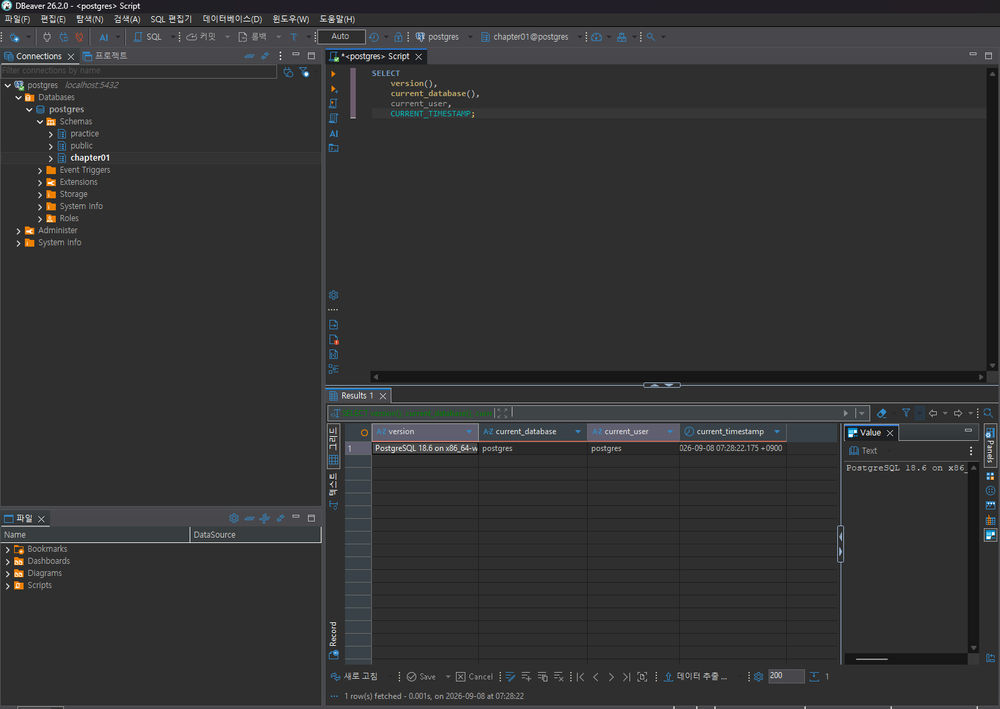
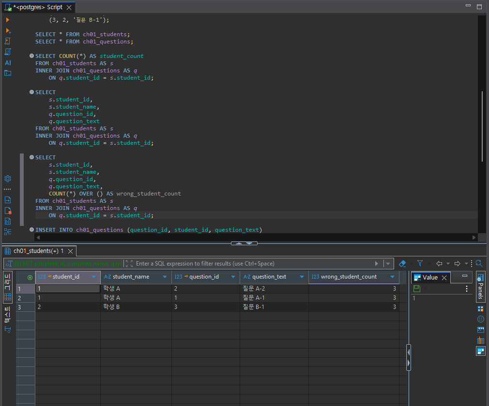
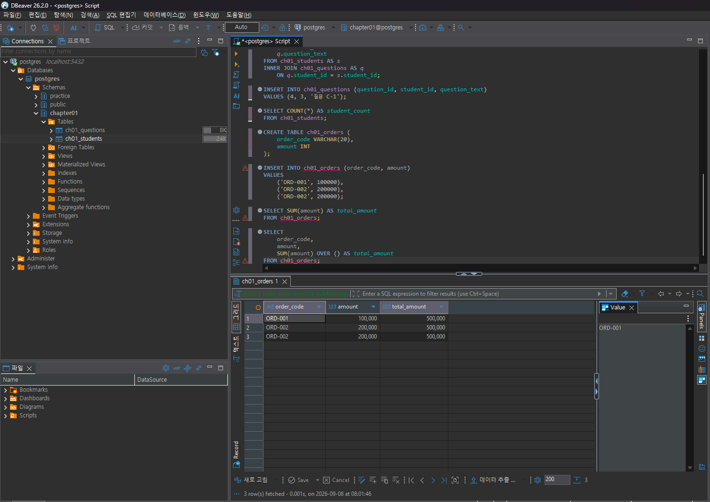
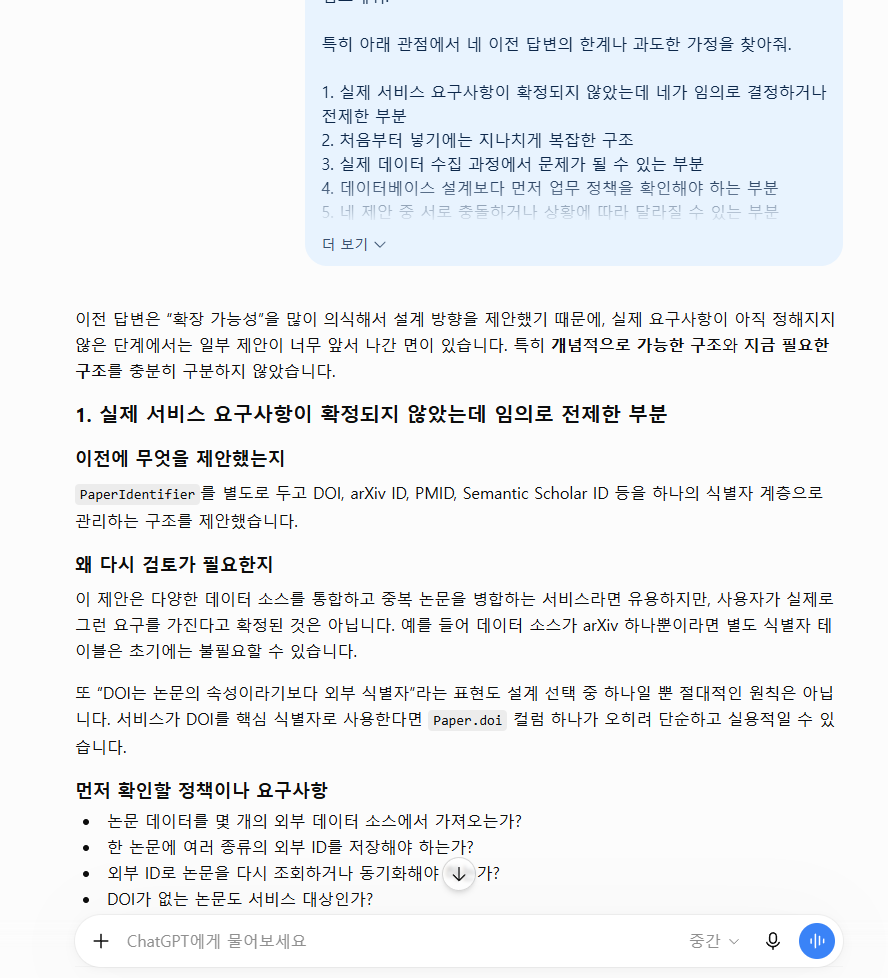

# Chapter 01 확장 실습 답안 템플릿

> **과제:** AI 시대에 데이터베이스를 왜 배워야 하는가  
> **사용 방법:** 이 파일을 내려받아 **본인의 GitHub 저장소**에 `chapter01_answer.md`라는 이름으로 저장한 뒤 답안을 작성합니다.  
> **제출 방법:** LMS에는 파일을 업로드하지 않고, **본인 GitHub 저장소의 `chapter01_answer.md` 파일 URL**을 제출합니다.

---

## 0. 학생 정보

| 항목 | 작성 내용 |
| --- | --- |
| 학번 | 2021-13369 |
| 이름 | 임우찬 |
| GitHub 계정 | youccode |
| 과제 작성일 | 2026.09.08 |
| 사용한 AI 도구 | chatgpt |

> 실제 비밀번호, API Key, 전체 DB 접속 URL, 개인정보는 이 파일이나 캡처 화면에 기록하지 않습니다.

---

# 1. PostgreSQL 실행 환경 확인

## 1-1. 실행한 SQL

```sql
SELECT version();
SELECT current_database();
SELECT current_user;
SELECT CURRENT_TIMESTAMP;
```

## 1-2. 실행 결과 기록

```text
PostgreSQL 버전: PostgreSQL 18.6 on x86_64-windows, compiled by msvc-19.44.35228, 64-bit
현재 데이터베이스:  postgres
현재 사용자: postgres
현재 시각: 2026-09-08 07:18:56.153 +0900
```

## 1-3. 내가 확인한 내용

1. SQL을 작성하는 프로그램과 PostgreSQL은 같은 프로그램인가요?

```text
나의 답: 같은 프로그램이 아니다. DBeaver와 같은 프로그램은 SQL을 작성하고 실행 요청을 보내는 클라이언트 도구이고,
PostgreSQL은 실제로 데이터를 저장하고 SQL을 처리하는 DBMS이다.
```

2. `current_database()` 결과는 무엇을 의미하나요?

```text
나의 답: 현재 SQL을 실행하고 있는 PostgreSQL과 연결해서 사용하고 있는 데이터베이스의 이름이다.
```

3. SQL이 실행되었다는 사실만으로 데이터 내용도 올바르다고 할 수 있나요?

```text
나의 답: 아니다. SQL이 오류 없이 실행됐다는 것은 SQL 구문이 DBMS에서 정상적으로 처리되었다는  것을 말하고, 
조회하거나 계산한 결과가 실제 업무 의미와 일치하는지까지는 보장해주지 않는다. 즉, 데이터 자체에 문제가 있거나 
잘못된 조건을 통해 실행된 SQL의 경우, 정상적으로 실행은 되더라도 결과는 잘못될 수 있다. 
```

## 1-4. 증거 화면

아래 경로에 캡처 이미지를 저장하는 것을 권장합니다.

```text
assignments/chapter01/images/step01_environment.png
```
이미지를 저장했다면 아래 링크의 파일명을 실제 파일명에 맞게 수정합니다.

```markdown

```

**이미지 삽입 위치:**


---

# 2. Chapter 01 핵심 내용 복습

교재 문장을 그대로 복사하지 말고 자신의 말로 작성합니다.

| 본문의 핵심 | 나의 설명 |
| --- | --- |
| AI가 SQL을 만들어도 DB를 배워야 한다 | AI가 SQL을 대신 작성해 줄 수는 있지만, 생성된 SQL이 데이터의 의미와 업무 목적에 맞는지는 사용자가 판단해야 한다. 따라서 데이터 구조와 SQL의 동작 원리를 이해할 필요가 있다. |
| 데이터 구조가 중요하다 | 같은 데이터라도 어떤 테이블과 속성으로 나누고 서로 어떤 관계를 맺도록 설계하는지에 따라 데이터의 정확성, 관리 편의성, 조회 결과가 달라질 수 있다. |
| SQL 결과를 검증해야 한다 | SQL이 오류 없이 실행되었다고 해서 결과가 반드시 올바른 것은 아니다. 잘못된 JOIN이나 조건, 집계 방법을 사용하면 문법적으로는 정상이어도 의미적으로 잘못된 결과가 나올 수 있다. |
| 데이터 품질이 AI 답변 품질에 영향을 준다 | AI가 올바른 분석을 하더라도 입력 데이터에 중복, 누락, 오류가 있으면 잘못된 결론을 낼 수 있다. 따라서 AI 활용 이전에 데이터의 품질과 신뢰성을 확인해야 한다. |
| 저장 방식은 데이터 양만 보고 선택하지 않는다 | 데이터가 적다고 항상 파일이나 스프레드시트가 적합한 것은 아니다. 여러 사용자의 동시 수정, 데이터 간 관계, 반복적인 조회와 집계, 일관성, 권한 관리, 백업 등의 조건을 함께 고려해야 한다. |

## 가장 중요하다고 생각한 한 문장

```text
SQL이나 AI가 정상적으로 결과를 만들어 냈다는 사실보다, 그 결과가 실제 데이터와 목적에 맞는지를 검증하는 것이 더 중요하다.
```

---

# 3. 실행 성공과 결과 정확성의 차이

## 3-1. SQL 실행 전 예상

학생 A는 질문 2개, 학생 B는 질문 1개, 학생 C는 질문이 없습니다.

```text
전체 학생 수: 3명
전체 질문 수: 3 개
질문이 있는 학생 수: 2 명
질문이 없는 학생 수: 1 명
```

## 3-2. 임시 테이블 생성 및 데이터 입력 완료 확인

- [x] `ch01_students` 생성
- [x] `ch01_questions` 생성
- [x] 학생 3명 입력
- [x] 질문 3건 입력
- [x] 두 테이블의 데이터를 직접 조회

## 3-3. 잘못된 학생 수 SQL 실행 결과

실행한 SQL:

```sql
SELECT COUNT(*) AS student_count
FROM ch01_students AS s
INNER JOIN ch01_questions AS q
    ON q.student_id = s.student_id;
```

실행 결과:

```text
3
```

## 3-4. JOIN 상세 결과 관찰

```text
학생 A가 나타난 행 수: 2
학생 B가 나타난 행 수: 1
학생 C가 나타난 행 수: 0
```

다음 질문에 답합니다.

### Q1. 학생 C가 왜 결과에서 사라졌나요?

```text
INNER JOIN은 두 테이블에서 JOIN 조건을 만족하는 행만 결과에 포함하기 때문이다.
학생 C는 질문 테이블에 연결된 질문이 없으므로 JOIN 조건을 만족하는 행이 없고,
따라서 결과에서 제외되었다.
```

### Q2. 학생 A가 왜 여러 행으로 나타났나요?

```text
학생 A에게 연결된 질문이 2개 있기 때문이다.
학생 테이블의 학생 A 한 행이 질문 테이블의 서로 다른 두 질문과 각각 JOIN되면서
결과에서 학생 A가 두 행으로 나타났다.
```

### Q3. 위 `COUNT(*)`가 실제로 세고 있었던 것은 무엇인가요?

```text
실제 학생 수가 아니라 INNER JOIN을 수행한 뒤 만들어진 결과 행의 개수를 세고 있었다.
이 예제에서는 질문이 있는 학생과 질문을 연결한 결과가 총 3행이므로 COUNT(*)의 결과가 3이 되었다.
```

### Q4. 결과 숫자가 우연히 실제 학생 수와 같아도 바로 믿으면 안 되는 이유는 무엇인가요?

```text
결과 숫자가 3으로 실제 학생 수와 같더라도 두 숫자가 의미하는 대상은 다르기 때문이다.
이 SQL은 학생 테이블의 학생 수가 아니라 JOIN 결과의 행 수를 세고 있으므로,
질문 데이터가 변경되면 실제 학생 수는 그대로여도 결과값이 달라질 수 있다.
```

## 3-5. 질문 한 건을 추가한 뒤 다시 실행

추가한 데이터:

```text
학생 C에게 질문 1건을 추가하였다.
(question_id = 4, student_id = 3, question_text = '질문 C-1')
```

다시 실행한 결과:

```text
AI SQL 결과: 4
실제 학생 수: 3
```

### 결과 해석

```text
데이터가 바뀐 뒤 무엇이 달라졌는지: 학생 C에게 질문이 한 건 추가되면서 기존에는 INNER JOIN 결과에 나타나지 않던 학생 C가 새롭게 포함되었다.
이에 따라 JOIN 결과 행 수가 3개에서 4개로 증가했고, COUNT(*)의 결과도 3에서 4로 증가했다.

실제 학생 수는 왜 그대로인지: 학생 C는 원래부터 ch01_students 테이블에 존재하던 학생이며, 새로운 학생을 추가한 것이 아니라
기존 학생 C의 질문만 추가했기 때문에 실제 학생 수는 여전히 3명이다. 

이 실험을 통해 알게 된 점: 처음에는 INNER JOIN 결과의 행 수가 실제 학생 수와 우연히 같았지만, 질문 데이터가 바뀌자 COUNT(*) 결과가 4로
증가하였다.
따라서 SQL이 오류 없이 실행되거나 결과값이 기대한 숫자와 같다고 해서 바로 믿어서는 안 되며, 해당 SQL이 실제로 무엇을 세고 있는지 확인해야
한다.
```

## 3-6. 학생 테이블을 직접 센 결과

```sql
SELECT COUNT(*) AS student_count
FROM ch01_students;
```

결과:

```text
3
```

### 두 SQL의 차이를 내 말로 설명

```text
첫 번째 SQL은 INNER JOIN을 수행한 뒤 만들어진 결과 행의 개수를 세고 있고, 두 번째 SQL은 ch01_students table에 실제로 저장된 학생들의 수를
세는 것이다. 

따라서 SQL을 검토할 때는 문법보다 먼저
해당 SQL이 내가 실제로 원하는 것을 조회하거나 세고 있는 것이 맞는지를 확인해야 한다.
```

## 3-7. 증거 화면

권장 경로:

```text
assignments/chapter01/images/step03_join_result.png
```

`여기에 STEP 3 핵심 증거 화면을 삽입하세요.`



---

# 4. 잘못된 데이터가 결과를 바꾸는 과정

## 4-1. 주문 데이터 확인

다음 데이터를 입력한 뒤 실제 결과를 확인합니다.

```text
ORD-001, 100000
ORD-002, 200000
ORD-002, 200000
```

## 4-2. 실행 전 예상

업무적으로 주문이 `ORD-001`, `ORD-002` 두 건이고 `order_code`가 주문을 고유하게 구분한다고 **가정할 경우** 예상 합계:

```text
300000 원
```

> 위 가정 자체가 실제 업무 규칙인지 확인해야 한다는 점도 기억합니다.

## 4-3. SQL 합계

```sql
SELECT SUM(amount) AS total_amount
FROM ch01_orders;
```

실제 결과:

```text
500000 원
```

## 4-4. 결과 해석

### `SUM` 문법 자체가 잘못된 것인가요?

```text
아니다. SUM 함수는 테이블에 저장된 amount 값을 정확하게 합산하고 있지만, 문제는 SQL 문법이 아니라 입력 데이터에 동일한 주문으로 보이는 
ORD-002가 중복되어 존재하는 것이다.
```

### 결과 차이의 원인은 무엇인가요?

```text
ORD-002가 2번 중복되어 들어가있는 것 때문이다. 업무적으로 order_code가 고유하게 주문을 식별한다고 한다면 ORD-002는 테이블 내에 한 번만
존재해야 하지만, 현재는 테이블에 같은 order_code의 주문이 2개 존재하고 이로 인하여 값이 중복 계산된다.
```

### SQL이 정확하게 실행되어도 업무 숫자가 잘못될 수 있는 이유를 설명하세요.

```text
SQL은 데이터베이스에 저장된 값을 기준으로 계산하기 때문에, 위와 같이 업무 데이터 자체에 존재하는 중복 데이터 혹은 데이터 누락 같은 문제가
있을 경우 SQL은 정상적으로 실행되더라도 업무적으로는 잘못된 값이 나올 수 있게 된다. 
```

## 4-5. AI에게 같은 데이터를 분석시킨 결과

AI가 계산한 합계:

```text
500000 원
```

AI가 중복 가능성을 언급했나요?

```text
네. ORD-002가 동일한 주문 코드와 금액으로 두 번 나타나므로 중복 데이터일 가능성이 있다고 언급했다.
```

AI가 `ORD-002` 두 행이 실제 두 주문인지 중복 입력인지 스스로 확정할 수 있나요? 이유도 적으세요.

```text
확정할 수 없다. 데이터만 보면 ORD-002가 중복되어 있다는 것은 알 수 있지만, 두 행이 실제로 서로 다른 주문인지 혹은 중복 입력된 것인지는
업무 규칙과 실제 기록을 확인하며 판단해야 알 수 있다. AI도 이러한 근거가 없으면 스스로 확정할 수 없다.
```

추가로 확인해야 할 업무 규칙:

```text
1. order_code는 반드시 주문 한 건마다 유일해야 하는가?
2. 같은 order_code가 여러 행으로 존재할 수 있는 예외 상황이 존재하는가?
3. 중복 주문을 판단하기 위해 order_code 외의 정보(주문 시각, 고객, 상품 등)에 대해서도 확인이 필요한가?
```

내가 최종적으로 내린 판단:

```text
현재 데이터만으로는 ORD-002 두 행 중 하나가 중복 입력이라고 확정 지을 수 없다. 그러나, order_code가 주문을 고유하게 식별한다는 
업무 규칙이 맞다면 해당 값들은 중복으로 판정이 가능하므로, 해당 경우에 대해서는 주문 합계가 300000원이다.  
```

## 4-6. 증거 화면

권장 경로:

```text
assignments/chapter01/images/step04_duplicate_result.png
```

`여기에 STEP 4 핵심 증거 화면을 삽입하세요.`



---

# 5. 파일·스프레드시트·DBMS 선택 연습

각 사례에 대해 **AI에게 묻기 전에 먼저 본인의 판단을 작성**합니다.

## 사례 A. 개인 독서 기록

```text
나의 선택: 스프레드 시트

선택 이유: 개인이 읽은 독서 기록을 관리하는 경우 데이터 구조가 상대적으로 단순할 것이다. 그러나 파일로 관리하기에는 책 제목, 저자, 읽은
날짜 등의 데이터들은 표 형태로 관리하는 것이 훨씬 용이할 것이기 때문에 스프레드 시트를 선택하였다.

어떤 조건이 추가되면 다른 방식으로 바꿀 것인지: 개인이 아닌 여러 명의 독서 기록을 관리해야 하는 경우라거나 동시 수정 혹은 복잡한 검색,
아니면 사용자나 리뷰 사이의 관계 등을 관리해야 되는 조건이 추가된다면 DBMS로 전환할 것이다.
```

## 사례 B. 동아리 행사 신청 명단

```text
나의 선택: 스프레드 시트

선택 이유: 참가자 수가 그렇게 많지 않을 것이고 저장해야될 데이터도 이름, 학번, 연락처, 참석 여부 정도로 비교적 단순할 것이므로 스프레드
시트로도 충분히 잘 관리될 것으로 생각된다. 

어떤 조건이 추가되면 다른 방식으로 바꿀 것인지: 행사가 자주 열리거나, 서로 다른 동아리 행사 간의 데이터를 서로 연결해서 비교하고 관리해야
된다는 조건이 추가된다면 DBMS로 전환할 것 같다.
```

## 사례 C. 온라인 강의 서비스

```text
나의 선택: DBMS

선택 이유: 상업적 목적으로 수행되는 온라인 강의 서비스의 경우에는 여러 사용자가 동시에 접근하고 사용자, 강의, 수강 신청, 진도, 결제
등등의 서로 관계가 있는 여러 데이터를 지속적으로 관리해야 되고 결제와 같은 경우 보안 역시 중요하므로 DBMS를 선택하였다.

어떤 조건이 추가되면 다른 방식으로 바꿀 것인지: 스타트업에서 현재 구상하고 있는 서비스를 테스트하는 정도의 수준이라면 스프레드 시트를
사용할 수도 있겠지만, 웬만하면 DBMS를 그냥 쓸 것 같다.
```

## 판단 기준 체크

- [x] 데이터 증가
- [x] 여러 사용자의 동시 수정
- [x] 데이터 사이의 관계
- [x] 반복 조회와 집계
- [x] 정확성·일관성
- [x] 변경 이력
- [x] 권한 구분
- [x] 백업·복구
- [x] 웹·앱에서 지속 사용

### 데이터가 적으면 무조건 스프레드시트를 사용해야 하나요?

```text
나의 답: 아니다. 데이터의 양이 적더라도 여러 사용자가 동시에 수정하거나, 데이터 간 관계가 복잡하고 정확성이나 일관성이 중요하다면 
DBMS가 더 적합할 수 있다. 저장 방식은 데이터 양뿐 아니라 사용 방식, 관계, 동시성, 권한 관리, 백업과 복구 등의 조건을 함께 고려해서
선택해야 한다
```

---

# 6. 나만의 서비스 데이터 구조 초안

> 이 내용은 이후 Chapter에서 계속 확장할 수 있으므로 신중하게 작성합니다.

## 6-1. 서비스 정의

```text
서비스 이름: 논문 인용 관계 탐색 서비스

이 서비스는 논문을 쓰는 과정에서 관련 related work을 정리하기 위해 reference를 찾는 과정에서 있으면 좋을 것 같다고 생각이 들었던 서비스로,
논문과 논문 사이의 인용 관계를 저장하고, 특정 논문이 어떤 논문을 인용했는지 또는 어떤 논문에게 인용되었는지를 쉽게 탐색하기 위한
서비스이다. 이를 통해 논문을 작성하거나 관련 연구를 조사할 때 하나의 논문에서 연결된 참고문헌을 연속적으로 탐색할 수 있도록 한다.
```

## 6-2. 관리할 데이터 후보

```text
1. 논문
2. 저자
3. 논문-저자 관계
4. 인용 관계
5. 학회 또는 저널 정보
```

## 6-3. 한 행의 의미

| 데이터 후보 | 한 행의 의미 |
| --- | --- |
| 논문 | 한 행은 하나의 논문을 의미한다. |
| 저자 | 한 행은 한 명의 저자를 의미한다. |
| 논문-저자 관계 | 한 행은 한 명의 저자가 한 논문에 참여한 관계를 의미한다. |
| 인용 관계 | 한 행은 한 논문이 다른 한 논문을 인용한 관계를 의미한다. |
| 학회 또는 저널 정보 | 한 행은 하나의 학회 또는 저널 출판 정보를 의미한다. |


## 6-4. 관계를 자연어로 설명

```text
1. 한 논문은 여러 명의 저자를 가질 수 있고, 한 저자도 여러 논문을 작성할 수 있다.
2. 한 논문은 여러 논문을 인용할 수 있고, 하나의 논문도 여러 다른 논문으로부터 인용될 수 있다.
3. 한 논문은 특정 학회 또는 저널에 출판될 수 있으며, 하나의 학회나 저널에는 여러 논문이 포함될 수 있다.
```

## 6-5. 아직 결정하지 않은 정책

```text
Q1. 같은 논문이 여러 데이터 소스에서 수집된 경우 DOI, 제목, 저자 정보 중 무엇을 기준으로 동일한 논문이라고 판단할 것인가?
Q2. arXiv 버전과 학회 출판 버전을 같은 논문으로 볼 것인가, 별개의 논문으로 저장할 것인가?
Q3. 인용 관계를 단순히 존재 여부만 저장할 것인가, 아니면 논문 본문의 어느 위치에서 어떤 맥락으로 인용되었는지도 저장할 것인가?
```

> 확정되지 않은 정책을 AI가 임의로 결정한 경우 그대로 받아들이지 않습니다.

---

# 7. AI를 검토자로 활용하기

## 7-1. 내가 AI에게 전달한 핵심 프롬프트

개인정보나 비밀번호 등 민감한 내용은 제거한 뒤 기록합니다.

```text
나는 논문과 논문 사이의 citation 관계를 저장하고 탐색할 수 있는 데이터베이스를 설계하려고 한다.

현재 생각한 데이터 구조는 다음과 같다.

- 논문
- 저자
- 논문-저자 관계
- 인용 관계
- 학회 또는 저널 정보

주요 관계는 다음과 같다.

1. 한 논문은 여러 저자를 가질 수 있고, 한 저자도 여러 논문을 작성할 수 있다.
2. 한 논문은 여러 논문을 인용할 수 있고, 하나의 논문도 여러 논문으로부터 인용될 수 있다.
3. 한 논문은 하나의 학회 또는 저널과 연결될 수 있다.

아직 확정하지 않은 정책은 다음과 같다.

- DOI, 제목, 저자 정보 중 무엇으로 동일 논문을 식별할 것인가
- arXiv 버전과 학회 출판 버전을 같은 논문으로 볼 것인가
- citation의 존재만 저장할지, citation 문맥까지 저장할지

이 데이터 구조를 검토하고,
빠진 데이터, 잘못된 가정, 애매한 정책, 확장 시 문제가 될 수 있는 부분을 5개 제안해줘.
확정되지 않은 정책은 임의로 결정하지 말고 질문 또는 선택지 형태로 제시해줘.
```

## 7-2. AI의 주요 제안과 나의 판단

최소 5개를 작성합니다.

| AI의 제안 | 수용 / 수정 / 거절 | 나의 판단 근거 |
| --- | --- | --- |
| DOI, arXiv ID, PMID, Semantic Scholar ID 같은 외부 식별자는 `Paper`의 단순 속성으로 두기보다 `PaperIdentifier` 같은 별도 구조로 관리하는 것이 좋다. | 수용 | DOI가 없는 논문도 있고, 하나의 연구가 여러 외부 식별자를 가질 수 있으므로 식별자를 별도로 관리하는 것이 확장에 유리하다고 판단했다. |
| arXiv 버전과 출판 버전의 관계를 표현하기 위해 `PaperVersion` 또는 `Work-Publication` 같은 구조를 고려해야 한다. | 수정 | 버전 관계를 표현해야 한다는 점은 수용하지만, 처음부터 복잡한 추상 계층을 두기보다는 각 버전을 독립된 논문으로 저장하고 `is_version_of` 같은 관계를 두는 방식으로 시작하는 것이 더 단순하다고 판단했다. |
| 저자 이름만으로는 동명이인과 이름 변형 문제가 발생할 수 있으므로 ORCID, affiliation, alias 등을 고려해야 한다. | 수용 | 실제 논문 데이터를 다루면 같은 이름을 가진 저자나 이름 표기 차이가 발생할 수 있으므로 저자 식별 문제를 별도로 고려해야 한다고 판단했다. |
| 논문-저자 관계에는 단순 연결뿐 아니라 author order와 corresponding author 여부도 저장하는 것이 좋다. | 수용 | 논문에서는 저자의 순서 자체가 의미를 가질 수 있고, 교신저자 여부도 중요한 정보이므로 관계 테이블에 속성으로 두는 것이 적절하다고 판단했다. |
| citation 자체와 실제 인용 위치를 구분하기 위해 `Citation`과 `CitationOccurrence`를 나누는 방식을 고려할 수 있다. | 수정 | 현재 서비스의 핵심은 논문 간 citation graph 탐색이므로 우선은 논문 간 edge만 저장하는 구조로 시작하고, 이후 citation context 분석이 필요해질 경우 `CitationOccurrence`를 추가하는 것이 적절하다고 판단했다. |
| 학회나 저널을 단순한 Venue 하나로만 관리하면 확장성이 부족할 수 있으므로 `VenueEdition` 또는 `JournalIssue`를 고려할 수 있다. | 수정 | 초기에는 학회명이나 저널명 수준의 정보만으로도 목적을 달성할 수 있으므로 단순 Venue 구조로 시작하고, 연도별 학회 edition이나 volume/issue 탐색 기능이 필요해질 때 확장하는 것이 좋다고 판단했다. |

## 7-3. AI에게 자기 답변을 다시 비판하도록 요청한 결과

첫 번째 답변과 달라진 점:

```text
첫 번째 답변에서는 향후 확장 가능성을 고려하여 PaperIdentifier, PaperVersion,
CitationOccurrence, VenueEdition 등의 여러 구조를 추가하는 방향으로만 주로 제안했다.

하지만 두 번째 답변에서는 이러한 구조들이 개념적으로는 가능할 지 몰라도, 현재 서비스 요구사항이 확정되지 않은 상태에서는 지나치게 
복잡할 수 있다고 지적했다. 특히 모든 기능을 처음부터 데이터베이스 구조에 반영하기보다는, 서비스의 핵심 사용 사례와 실제 데이터 
수집 방법을 먼저 정한 뒤 추후에 필요한 구조를 추가하는 방식이 더 적절하다고 설명하였다.

또한 단순히 ERD를 확장하는 문제보다, 논문의 동일성을 어떻게 판단할 것인지, citation graph의 노드를 무엇으로 정의할 것인지,
어떤 사용자 질의를 지원할 것인지와 같은 정책을 먼저 정해야 한다는 점을 강조하였다.
```

AI가 처음에 임의로 가정했던 내용:

```text
AI는 처음 답변에서 여러 외부 데이터 소스를 통합할 가능성이 높고, DOI뿐 아니라 여러 종류의 논문 식별자를 관리해야 한다고 가정했다.

또한 arXiv와 출판본의 관계를 장기적으로 관리해야 하고, 저자를 실제 인물 단위로 식별해야 하며, ORCID나 affiliation 같은 정보를 
충분히 확보할 수 있다고 가정했다.

citation의 경우에도 인용 대상 논문이 DB의 Paper와 정확하게 연결될 수 있고, 향후 citation context 분석이 필요할 가능성이 높다고 가정했다.

또 학회 edition이나 journal issue까지 세분화하는 것이 장기적으로 유리하고, 확장성을 위해 초기 데이터 구조가 복잡해지는 것을 
어느 정도 허용할 수 있다고 가정했다.

하지만 이러한 내용은 모두 가능한 설계 선택일 뿐, 현재 서비스의 요구사항만으로 확정할 수 있는 사항은 아니었다.
```

추가로 업무 담당자에게 확인해야 한다고 판단한 내용:

```text
1. 이 서비스의 핵심 기능이 논문 검색, citation graph 탐색, citation count, 저자 탐색, 추천 중 무엇인지 확인해야 한다.

2. citation graph의 한 노드를 개별 출판물로 볼 것인지, 같은 연구의 여러 버전을 묶은 하나의 work로 볼 것인지 정해야 한다.

3. 논문 데이터를 하나의 API에서 가져올 것인지, 여러 외부 데이터 소스를 통합할 것인지 확인해야 한다.

4. DOI, 제목, 저자 등이 비슷한 논문을 어떤 기준으로 동일한 논문이라고 판단할지 정해야 한다.

5. arXiv 버전과 학회 또는 저널 출판본을 같은 논문으로 보여줄지, 서로 다른 논문으로 보여줄지 결정해야 한다.

6. 저자의 동일인 식별이 핵심 기능인지, 아니면 논문에 기록된 저자 이름을 표시하는 정도면 충분한지 확인해야 한다.

7. citation 관계의 존재 여부만 저장할지, 인용 횟수나 인용 문장 및 위치까지 저장할지 정해야 한다.

8. 참고문헌 정보는 존재하지만 DB 내부의 특정 Paper와 연결하지 못한 경우에도 해당 정보를 보존할지 결정해야 한다.

9. 논문 데이터가 어느 출처에서 수집되었는지와 데이터의 변경 이력까지 관리할 필요가 있는지 확인해야 한다.

10. 초기 서비스에서 예상하는 데이터 규모와 주요 조회 방식이 무엇인지 확인해야 한다.
```

## 7-4. AI 활용에 대한 나의 평가

```text
가장 유용했던 부분: 
처음에는 논문, 저자, citation 관계 정도만 생각했지만, AI의 검토를 통해 논문 식별자 관리, arXiv와 출판본의 관계,
저자 동명이인 문제, citation context, 데이터 출처와 매칭 실패 문제 등 실제 데이터를 수집하고 운영할 때 발생할 수 있는 
여러 문제를 미리 생각해볼 수 있었다.

수정하거나 거절한 부분: 
PaperIdentifier, PaperVersion, CitationOccurrence, VenueEdition 같은 구조를 초기 단계부터 모두 별도 엔티티로 분리해야 한다는 방향은
그대로 수용하지 않았다. 또한 arXiv와 출판본, citation context, venue 세부 구조에 대해서도 특정한 방식으로 바로 결정하지 않고 서비스
요구사항에 따라 나중에 정하기로 했다.

그렇게 판단한 근거:
현재 서비스의 핵심 목적은 논문 사이의 citation 관계를 탐색하는 것이므로, 처음부터 지나치게 복잡한 구조를 만들기보다는 
핵심 기능에 필요한 구조만 먼저 만들고 실제 데이터 수집 방식과 사용자 요구가 구체화된 뒤 필요한 구조를 확장하는 것이 
더 적절하다고 판단했다. 또한 논문의 동일성, citation graph의 노드 기준, 저자 동일인 판정 같은 문제는 단순한 DB 구조 문제가 아니라
서비스 정책과 데이터 품질에 따라 달라질 수 있기 때문이다.

AI가 없었다면 놓쳤을 가능성이 있는 질문:
DOI가 없는 논문을 어떻게 식별할지, 같은 연구의 arXiv 버전과 학회 출판본을 어떻게 연결할지, 동명이인 저자를 어떤 기준으로 구분할지,
DB 내부의 Paper와 매칭되지 않는 참고문헌을 어떻게 처리할지, 수집 데이터의 출처와 신뢰도를 함께 저장할 필요가 있는지에 대한 
질문을 놓쳤을 가능성이 있다.
```

## 7-5. AI 활용 증거 화면

권장 경로:

```text
assignments/chapter01/images/step07_ai_review.png
```

AI 대화 전체를 캡처할 필요는 없습니다. 핵심 요청과 검토 과정이 보이는 화면 1장 정도면 충분합니다.



---

# 8. 기준 데이터·파생 데이터·AI 생성 결과 구분

내 서비스에 맞게 작성합니다.

| 구분 | 내 서비스의 예 | 판단 이유 |
| --- | --- | --- |
| 기준 데이터 | 논문 제목, 저자, DOI 또는 외부 식별자, 출판 연도, 논문 간 실제 citation 관계 | 외부 논문 데이터나 논문 원문에서 확인할 수 있는 사실이며 다른 분석의 기반이 되는 데이터이기 때문이다. |
| 파생 데이터 | 특정 논문의 citation 수, 특정 논문으로부터 2-hop 또는 N-hop으로 연결된 논문 목록, 논문 간 연결 정도 | 기준 데이터에 저장된 논문 정보와 citation 관계를 이용해 SQL이나 프로그램으로 계산해서 얻는 값이기 때문이다. |
| AI 생성 결과 | 논문 요약, 관련 논문 추천, citation 관계에 대한 설명, 특정 논문을 참고해야 하는 이유에 대한 설명 | 원본 데이터 자체가 아니라 AI가 기존 데이터를 바탕으로 요약하거나 추론해서 생성한 결과이기 때문이다. |


### 기준 데이터가 변경되면 파생 데이터는 어떻게 해야 하나요?

```text
citation 관계나 논문 정보 같은 기준 데이터가 변경되면 citation 수, 연결된 논문 목록, 논문 간 연결 정도와 같은 파생 데이터도
변경된 기준 데이터에 맞게 다시 계산하거나 갱신해야 한다.

기준 데이터와 파생 데이터가 서로 다른 시점의 상태를 나타내지 않도록 일관성을 유지하는 것이 중요하다.
```

### AI 결과만 있고 원본 데이터가 없다면 결과를 충분히 검증할 수 있나요?

```text
충분히 검증하기 어렵다.

예를 들어 AI가 특정 논문이 중요한 reference라고 추천하거나 두 논문 사이의 citation 관계를 설명하더라도,
실제 논문 정보와 citation 데이터가 없다면 그 설명이 사실인지 확인하기 어렵다.

따라서 AI가 생성한 결과는 원본 논문 정보와 실제 citation 관계를 함께 확인할 수 있어야 신뢰성 있게 검증할 수 있다.
```

---

# 9. 최종 성찰

아래 세 문장은 반드시 **본인의 말**로 작성합니다.

```text
1. SQL이 실행되어도 결과를 바로 믿으면 안 되는 이유는
   SQL이 문법적으로 정상적으로 수행됐다는 것과 내가 의도한 데이터를 정확히 조회했다거나 계산했다는 것은 서로 다른 문제이기 때문이다.

2. AI를 데이터베이스 학습에 활용할 때 가장 중요한 것은
   AI가 제안한 것을 그대로 받아들이지 않고, 실제 데이터와 요구 사항을 잘 충족하는지 직접 검토하고 판단하는 것이다.

3. 이번 실습 이후 내가 더 확인하고 싶은 것은
   논문 citation graph와 같이 관계가 복잡한 데이터를 실제 관계형 데이터베이스에서 어떻게 설계하고,
   여러 단계의 citation 관계를 SQL로 효율적으로 조회할 수 있는지이다.
```

## 이번 Chapter에서 새롭게 알게 된 점 3가지

```text
1. SQL이 오류 없이 실행되었다는 사실과 결과가 의미적으로 정확하다는 것은 서로 다른 문제라는 것을 알게 되었다.

2. 데이터에 중복이나 누락이 있으면 SUM이나 COUNT 같은 SQL 함수가 정확하게 동작해도
   실제 업무에서 원하는 값과 다른 결과가 나올 수 있다는 것을 알게 되었다.

3. 데이터베이스 구조를 설계할 때는 단순히 데이터를 저장하는 것뿐 아니라
   데이터 사이의 관계, 동일성을 판단하는 정책, 실제 사용자가 어떤 조회를 할 것인지까지 함께 고려해야 한다는 것을 알게 되었다.
```

## 아직 이해가 명확하지 않은 부분

```text
1. 논문처럼 하나의 대상이 arXiv 버전, 학회 출판본 등 여러 형태로 존재할 때
   동일한 논문으로 처리할지 별개의 데이터로 처리할지를 데이터베이스에서 어떻게 설계하는 것이 가장 적절한지 아직 명확하지 않다.

2. citation graph에서 한 논문에서 시작해 여러 단계로 연결된 논문을 탐색할 때
   관계형 데이터베이스에서 재귀적인 관계를 어떤 SQL 방식으로 효율적으로 조회하는지 더 공부하고 싶다.
```

---

# 10. 제출 전 자기 점검

- [x] PostgreSQL 실행 화면을 확인했다.
- [x] SQL 실행 전에 예상 결과를 먼저 작성했다.
- [x] `INNER JOIN` 예제에서 누락과 반복을 설명할 수 있다.
- [x] 숫자가 우연히 같아도 의미가 다를 수 있음을 설명했다.
- [x] 중복 데이터가 집계 결과에 미치는 영향을 확인했다.
- [x] 저장 방식을 데이터 양만으로 판단하지 않았다.
- [x] 개인 서비스 주제를 하나 정했다.
- [x] 데이터 후보와 한 행의 의미를 작성했다.
- [x] 미확정 정책을 최소 3개 작성했다.
- [x] AI 제안을 수용·수정·거절로 구분했다.
- [x] AI 제안에 대한 판단 근거를 작성했다.
- [x] 기준 데이터·파생 데이터·AI 결과를 구분했다.
- [x] 핵심 증거 이미지가 Markdown에서 정상적으로 보인다.
- [x] 비밀번호·API Key·개인정보가 노출되지 않았다.

---

# 11. LMS 제출 정보

## 내 GitHub 답안 파일 URL

아래에는 **교수자 템플릿 URL이 아니라 본인이 작성한 답안 파일의 GitHub URL**을 기록합니다.

```text
https://github.com/<본인-GitHub-ID>/<본인-저장소>/blob/main/assignments/chapter01/chapter01_answer.md
```

내 실제 제출 URL:

```text
https://github.com/youccode/database-course-2026-2/blob/main/assignments/chapter01/chapter01_answer.md
```

> LMS에는 위 **본인 저장소의 `chapter01_answer.md` 파일 URL 하나**를 제출합니다.

---

## 권장 학생 저장소 구조

```text
<본인-저장소>/
└── assignments/
    └── chapter01/
        ├── chapter01_answer.md
        └── images/
            ├── step01_environment.png
            ├── step03_join_result.png
            ├── step04_duplicate_result.png
            └── step07_ai_review.png
```

이 구조를 사용하면 이후 Chapter 02, Chapter 03도 같은 방식으로 계속 추가할 수 있습니다.
