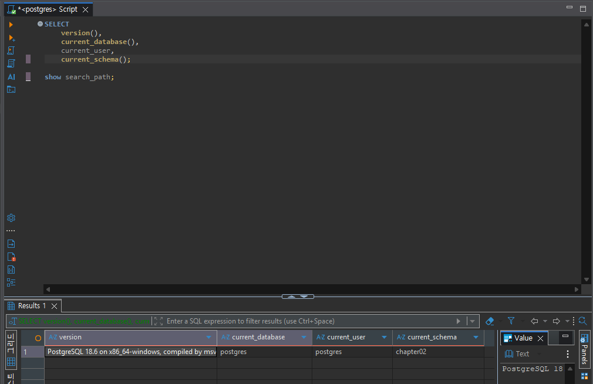
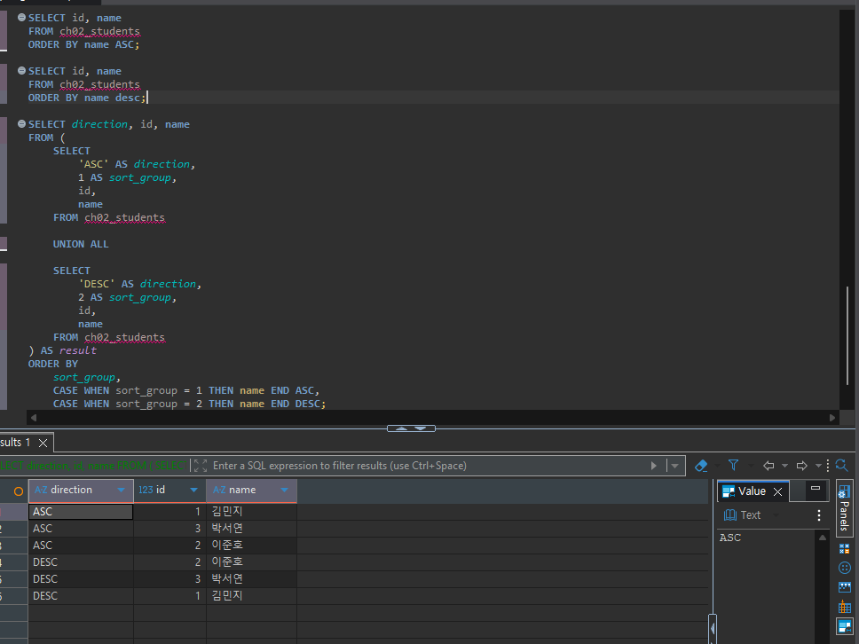
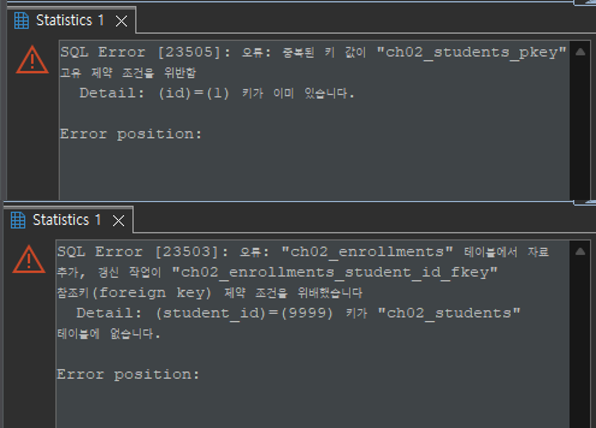
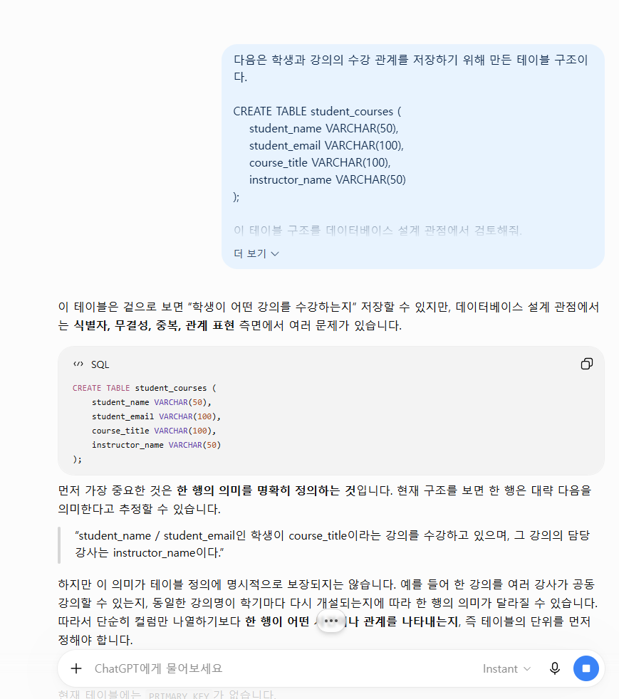

# Chapter 02 확장 실습 답안 템플릿

> **과제:** 데이터와 DBMS의 기본 개념  
> **사용 방법:** 이 파일을 내려받아 본인의 GitHub 저장소에 `chapter02_answer.md`라는 이름으로 저장한 뒤 실습하면서 바로 작성합니다.  
> **제출 방법:** LMS에는 파일을 직접 업로드하지 않고, **본인 GitHub 저장소의 `chapter02_answer.md` 파일 URL**을 제출합니다.

---

## 제출 전 개인정보 주의

LMS에서 제출자를 확인할 수 있으므로 이 공개 Markdown 파일에 학번이나 실명을 반드시 적을 필요는 없습니다.

```text
GitHub 계정 또는 별칭: youccode
과제 작성일: 2026.09.15
사용한 AI 도구: chatgpt
```

> 실제 비밀번호, API Key, 전체 DB 접속 URL, 개인정보가 포함된 화면은 올리지 않습니다.

---

# 1. PostgreSQL에서 현재 위치 확인

## 1-1. 실행한 SQL

```sql
SELECT version();
SELECT current_database();
SELECT current_user;
SELECT current_schema();
SHOW search_path;
```

## 1-2. 실행 결과 기록

```text
PostgreSQL 버전: PostgreSQL 18.6 on x86_64-windows, compiled by msvc-19.44.35228, 64-bit
현재 데이터베이스: postgres
현재 사용자: postgres
현재 스키마: chapter02
search_path: chapter02, "$user", public
```

## 1-3. 구조를 내 말로 설명

```text
PostgreSQL은: 데이터를 저장하고 관리하며, 사용자가 보낸 SQL을 실제로 처리하는 DBMS이다.

현재 접속한 데이터베이스는: PostgreSQL 서버 안에 있는 여러 데이터베이스 중 현재 SQL을 실행하고 있는 postgres 데이터베이스이다.

스키마는: 하나의 데이터베이스 안에서 테이블 같은 객체를 이름 공간 단위로 묶어 관리하는 구조이다. 현재 스키마는 chapter02이다.

DBeaver 또는 psql 같은 도구는:  PostgreSQL에 접속해서 SQL을 보내고 실행 결과를 확인하기 위한 클라이언트 도구이다.
```

## 1-4. 계층 구조 완성

```text
사용자
→ DBeaver 또는 psql과 같은 클라이언트 도구
→ PostgreSQL DBMS
→ 데이터베이스(postgres)
→ 스키마(chapter02)
→ 테이블
→ 행 / 열
```

## 1-5. 증거 화면

권장 경로:

```text
assignments/chapter02/images/step01_environment.png
```



---

# 2. 데이터베이스 안의 스키마와 테이블 관찰

## 2-1. 스키마 조회 결과

실행한 SQL:

```sql
SELECT schema_name
FROM information_schema.schemata
ORDER BY schema_name;
```

관찰한 스키마 이름 중 3개 이내를 적습니다.

```text
1. chapter01
2. chapter02
3. information_schema
```

### `public`은 무엇인가요?

```text
나의 설명: public은 PostgreSQL 데이터베이스에 기본적으로 존재하는 스키마 중 하나이다.
스키마를 따로 지정하지 않고 객체를 만들거나 찾을 때 search_path 설정에 따라 public이 사용될 수 있다.
즉 public 자체가 별도의 데이터베이스인 것은 아니다.
```

### 데이터베이스와 스키마는 같은 것인가요?

```text
나의 설명: 같은 것이 아니다. 데이터베이스가 더 큰 논리적 저장 공간이고,
그 안에서 스키마를 사용해 테이블과 같은 객체들을 이름 공간별로 나누어 관리할 수 있다.
```

## 2-2. 현재 보이는 테이블 조회

```sql
SELECT table_schema, table_name
FROM information_schema.tables
WHERE table_type = 'BASE TABLE'
  AND table_schema NOT IN ('pg_catalog', 'information_schema')
ORDER BY table_schema, table_name;
```

```text
조회된 사용자 테이블 수 또는 눈에 띈 테이블: 총 4개의 사용자 테이블이 조회되었다.
chapter01 스키마에는 ch01_orders, ch01_questions, ch01_students가 있었고,
practice 스키마에는 members 테이블이 있었다.

아직 테이블이 거의 없어도 괜찮은 이유: 현재 데이터베이스에 지금까지 직접 생성한 테이블만 존재하기 때문이다.
또한 Chapter 02에서 사용할 임시 테이블은 아직 생성하기 전이므로 조회 결과에 나타나지 않았다.
이 단계의 목적은 현재 데이터베이스 안에 어떤 사용자 테이블이 존재하는지 확인하는 것이므로
테이블 수가 적어도 문제가 되지 않는다.
```

## 2-3. 관찰 정리

```text
PostgreSQL 서버 안에는 여러 데이터베이스가 있을 수 있다.
한 데이터베이스 안에는 여러 스키마가 있을 수 있다.
스키마 안에는 테이블과 같은 데이터베이스 객체가 존재한다.
```

---

# 3. TEMP TABLE로 테이블·행·열·키 직접 확인

## 3-1. 임시 테이블 생성 완료 확인

- [x] `ch02_students` 생성
- [x] `ch02_courses` 생성
- [x] `ch02_enrollments` 생성

각 테이블의 **한 행 의미**를 적습니다.

| 테이블 | 한 행의 의미 |
| --- | --- |
| `ch02_students` | 한 행은 학생 한 명을 의미한다. |
| `ch02_courses` | 한 행은 강의 한 개를 의미한다. |
| `ch02_enrollments` | 한 행은 한 학생이 한 강의를 수강 신청한 관계 한 건을 의미한다. |

## 3-2. 열의 의미 확인

### `ch02_students`

| 열 | 값의 의미 | 내부 식별자 / 업무 식별자 / 일반 속성 |
| --- | --- | --- |
| `id` | DB 안에서 학생 한 명을 구분하기 위한 값 | 내부 식별자 |
| `student_number` | 학교 업무에서 학생을 구분할 때 사용하는 학번 | 업무 식별자 |
| `name` | 학생의 이름 | 일반 속성 |
| `major` | 학생의 전공 | 일반 속성 |

### `ch02_enrollments`

| 열 | 값의 의미 | PK / FK / 일반 속성 |
| --- | --- | --- |
| `id` | 수강신청 한 건을 구분하는 값 | PK |
| `student_id` | 이 수강신청을 한 학생의 ch02_students.id | FK |
| `course_id` | 이 수강신청이 연결된 강의의 ch02_courses.id | FK |
| `status` | 수강중, 수강완료 같은 현재 수강 상태 | 일반 속성 |

## 3-3. 입력된 행 수

```text
students 행 수: 3
courses 행 수: 2
enrollments 행 수: 3
```

## 3-4. 내부 식별자와 업무 식별자

```text
students.id가 필요한 이유: 데이터베이스 내부에서 학생 행을 안정적으로 구분하고 다른 테이블이 해당 학생을 참조하기 위한 기준이 필요하기 때문이다.

student_number가 필요한 이유: 실제 학교 업무에서는 사용자가 학생을 학번으로 식별하고 확인하는 경우가 많기 때문이다.

둘을 항상 같은 값으로 사용하지 않아도 되는 이유: id는 DB 내부 관계를 위한 식별자이고 student_number는 학교 업무 규칙에 따른 식별자이므로 역할이 다르다.
학번의 형식이나 정책이 바뀌더라도 내부 관계에 사용하는 id까지 같이 바꿀 필요가 없도록 분리할 수 있다.
```

## 3-5. 숫자처럼 보이는 학번을 문자열로 저장한 이유

```text
나의 설명: 학번은 숫자로만 보이더라도 더하거나 계산하기 위한 값이 아니라 학생을 구분하는 코드에 가깝다.
또한 앞자리 0이 필요할 수도 있고 나중에 문자나 구분 기호가 포함될 수도 있으므로 숫자형보다 문자열로 저장하는 편이 의미에 맞다.
```

---

# 4. 테이블과 조회 결과는 다르다

## 4-1. 원본 테이블 행 수

```text
ch02_students 전체 행 수: 3
```

## 4-2. 일부 열만 조회

실행 SQL: 

```sql
SELECT name, major
FROM ch02_students
ORDER BY id;
```

```text
원본 테이블의 열 수와 조회 결과의 열 수가 다른 이유: ch02_students에는 id, student_number, name, major의 4개 열이 있지만,
SELECT 절에서 name과 major 두 열만 선택했기 때문에 조회 결과에는 선택한 두 열만 나타난다. 원본 테이블의 구조가 바뀐 것은 아니다.
```

## 4-3. 조건을 적용한 조회

실행 SQL:

```sql
SELECT id, student_number, name, major
FROM ch02_students
WHERE major = '컴퓨터공학'
ORDER BY id;
```

```text
원본 테이블 행 수: 3
조회 결과 행 수: 1
원본 테이블의 데이터가 삭제된 것인가?: 아니다.
그렇게 판단한 이유: WHERE 조건은 원본 테이블에서 행을 삭제하는 것이 아니라 SELECT 결과에 포함할 행만 고른다.
따라서 컴퓨터공학 학생만 1행 보이더라도 ch02_students에는 기존 3행이 그대로 남아 있다.
```

## 4-4. 정렬 결과 비교

```sql
SELECT id, name
FROM ch02_students
ORDER BY name ASC;

SELECT id, name
FROM ch02_students
ORDER BY name DESC;
```

```text
ASC 결과의 첫 학생: 김민지
DESC 결과의 첫 학생: 이준호

이 실험을 통해 ORDER BY에 대해 알게 된 점: 같은 테이블을 조회하더라도 ORDER BY의 방향에 따라 결과가 표시되는 순서가 달라진다.
또한 ORDER BY를 명시하지 않은 조회 결과의 행 순서를 업무적으로 고정된 순서라고 가정하면 안 된다.
```

## 4-5. 증거 화면

권장 경로:

```text
assignments/chapter02/images/step04_result_set.png
```



---

# 5. PK와 FK를 실제로 관찰

## 5-1. 정상 데이터의 관계 읽기

다음 SQL 결과를 보고 작성합니다.

```sql
SELECT
    e.id AS enrollment_id,
    s.name AS student_name,
    c.title AS course_title,
    e.status
FROM ch02_enrollments AS e
JOIN ch02_students AS s
    ON s.id = e.student_id
JOIN ch02_courses AS c
    ON c.id = e.course_id
ORDER BY e.id;
```

```text
한 행이 의미하는 것: 학생 한 명이 강의 한 개를 수강하고 있는 관계 한 건과 그 상태를 의미한다.

같은 student_id가 여러 enrollment 행에서 반복될 수 있는 이유: 한 학생이 여러 강의를 수강할 수 있으므로 같은 학생을 가리키는 FK가 여러 수강신청 행에 나타날 수 있다.


같은 course_id가 여러 enrollment 행에서 반복될 수 있는 이유: 하나의 강의를 여러 학생이 수강할 수 있으므로 같은 강의를 가리키는 FK가 여러 수강신청 행에 나타날 수 있다.
```

## 5-2. 기본키 중복 오류 관찰

중복 PK 입력을 시도한 결과:

```text
실행 성공 / 실패: 실패
오류 메시지에서 확인한 핵심 단어: 중복된 키, 고유 제약 조건, ch02_students_pkey
왜 실패했다고 생각하는가: id는 PRIMARY KEY이므로 각 행에서 고유해야 하는데 이미 존재하는 id = 1을 다시 입력했기 때문이다.
```

## 5-3. 존재하지 않는 학생을 참조하는 FK 오류 관찰

존재하지 않는 `student_id`를 사용한 수강신청 입력 결과:

```text
실행 성공 / 실패: 실패
오류 메시지에서 확인한 핵심 단어: 참조키(foreign key) 제약 조건, student_id, 테이블에 없습니다
왜 실패했다고 생각하는가: student_id는 ch02_students.id를 참조하는 FK인데, ch02_students에 id = 9999인 학생이 존재하지 않기 때문이다.
```

## 5-4. PK와 FK의 차이 정리

```text
PK는 한 테이블 안에서 각 행을 고유하게 식별하기 위한 키이다.

FK는 현재 테이블의 값이 다른 테이블의 특정 행을 참조하도록 연결하기 위한 키이다.

FK 값이 여러 행에서 반복될 수 있는 이유는
 여러 행이 같은 부모 행을 참조하는 1:N 관계가 존재할 수 있기 때문이다.
```

## 5-5. 증거 화면

권장 경로:

```text
assignments/chapter02/images/step05_pk_fk.png
```

> 오류 메시지는 전체 화면이 아니라 테이블명·constraint·참조 오류가 보이는 정도만 캡처합니다.



---

# 6. 관계와 카디널리티를 자연어로 설명

현재 임시 데이터 기준으로 작성합니다.

```text
학생 한 명은 여러 수강신청을 가질 수 있는가?: 그렇다. 한 학생이 여러 강의를 들을 수 있으므로 여러 enrollment 행과 연결될 수 있다.

강의 한 개는 여러 수강신청을 가질 수 있는가?: 그렇다. 같은 강의를 여러 학생이 신청할 수 있으므로 여러 enrollment 행과 연결될 수 있다.

수강신청 한 건은 학생 몇 명을 참조하는가?: 한 명을 참조한다.

수강신청 한 건은 강의 몇 개를 참조하는가?: 한 개를 참조한다.
```

아래 구조를 완성합니다.

```text
students 1 ── N enrollments N ── 1 courses
```

### 학생과 강의가 N:M 관계라고 볼 수 있는 이유

```text
나의 설명: 한 학생은 여러 강의를 수강할 수 있고, 하나의 강의에도 여러 학생이 참여할 수 있기 때문이다.
관계형 데이터베이스에서는 이 N:M 관계를 students와 courses를 직접 여러 값으로 연결하기보다 enrollments 같은 중간 테이블의 여러 행으로 표현할 수 있다.
```

> 아직 0개 허용 여부, 필수 관계, 삭제 정책까지 확정하지 않습니다. 그런 규칙은 Chapter 05~06에서 다룹니다.

---

# 7. AI가 만든 테이블 구조 직접 검토

## 7-1. AI에게 묻기 전에 내가 먼저 찾은 문제

다음 구조를 보고 최소 4개를 적습니다.

```sql
CREATE TABLE student_courses (
    student_name VARCHAR(50),
    student_email VARCHAR(100),
    course_title VARCHAR(100),
    instructor_name VARCHAR(50)
);
```

```text
문제 1. 각 행을 고유하게 구분할 PRIMARY KEY가 없다.
문제 2. 학생, 강의, 강사 정보가 한 테이블에 함께 들어가 같은 학생이나 강의 정보가 여러 행에서 반복될 수 있다.
문제 3. student_name, course_title 같은 이름 문자열만으로 대상을 구분하면 동명이인이나 같은 제목의 강의를 안전하게 식별하기 어렵다.
문제 4. 학생-강의 관계를 참조하는 FOREIGN KEY가 없어서 실제 존재하는 학생과 강의만 연결된다는 것을 DB가 보장하기 어렵다.
```

## 7-2. AI 검토 요청 프롬프트

사용한 핵심 프롬프트를 기록합니다.

```text
다음은 학생과 강의의 수강 관계를 저장하기 위해 만든 테이블 구조이다.

CREATE TABLE student_courses (
    student_name VARCHAR(50),
    student_email VARCHAR(100),
    course_title VARCHAR(100),
    instructor_name VARCHAR(50)
);

이 테이블 구조를 데이터베이스 설계 관점에서 검토해줘.

특히 다음 관점에서 문제점을 찾아줘.

1. 한 행이 정확히 무엇을 의미하는지
2. 각 행을 고유하게 구분할 PK가 있는지
3. 학생과 강의를 이름이나 문자열만으로 식별할 때 어떤 문제가 생길 수 있는지
4. 학생, 강의, 수강 관계를 하나의 테이블에 모두 저장했을 때 어떤 문제가 생길 수 있는지
5. 학생과 강의 사이의 관계와 FK를 어떻게 표현하는 것이 더 적절한지

최소 4개의 문제를 설명해줘.

단, 단순히 정답 구조만 제시하지 말고
각 문제가 왜 문제인지 먼저 설명해줘.

또한 아직 업무 규칙이 정해지지 않아 확정할 수 없는 내용이 있다면
임의로 결정하지 말고 "추가로 확인해야 할 사항"이라고 구분해줘.
```

## 7-3. AI 제안과 나의 판단

| AI의 지적 또는 제안 | 동의 / 수정 / 보류 | 나의 근거 |
| --- | --- | --- |
| 현재 테이블에는 각 행을 고유하게 구분할 PK가 없으므로 중복된 수강 정보가 입력될 수 있다. | 동의 | Chapter 02에서 PK는 한 행을 고유하게 식별하는 역할을 한다고 배웠고, 현재 구조에는 그런 기준이 없기 때문에 같은 수강 정보가 여러 번 들어가도 구분하기 어렵다고 생각했다. |
| 학생 이름이나 이메일 대신 `student_id`와 같은 내부 식별자를 두는 것이 좋다. | 동의 | 이름은 동명이인이 있을 수 있고 이메일은 변경될 가능성이 있으므로 학생 자체를 식별하는 내부 ID와 학생의 속성을 분리하는 것이 더 적절하다고 판단했다. |
| 강의도 `course_title`만으로 구분하지 말고 `course_id`와 같은 식별자를 두는 것이 좋다. | 동의 | 같은 제목의 강의가 여러 학기나 다른 학과에서 존재할 수 있으므로 제목 자체를 강의의 고유 식별자로 보는 것은 위험하다고 생각했다. |
| 학생, 강의, 수강 관계를 `students`, `courses`, `enrollments`로 나누고 FK로 연결하는 것이 적절하다. | 동의 | 학생과 강의는 각각 독립적으로 관리되는 대상이고, 수강신청은 두 대상을 연결하는 관계이므로 각각의 의미를 분리하는 것이 더 명확하다고 판단했다. |
| `(student_id, course_id)`를 `enrollments`의 복합 PK로 사용할 수 있다. | 보류 | 한 학생이 같은 강의를 다시 수강할 수 있는지, 학기별 강좌를 별도로 구분하는지에 따라 같은 학생-강의 조합이 여러 번 존재할 수도 있으므로 업무 규칙을 먼저 확인해야 한다. |

## 7-4. 본문과 대조한 항목

AI 설명 중 최소 하나를 `chapter02.md`와 비교합니다.

```text
AI가 설명한 내용: 학생과 강의의 관계는 N:M 관계이므로 students와 courses를 직접 문자열로 반복해서 저장하기보다,
enrollments와 같은 연결 테이블을 두고 student_id와 course_id를 FK로 참조하는 것이 적절하다고 설명했다.

본문에서 확인한 내용: Chapter 02에서는 학생과 강의 사이의 관계를 enrollments 테이블을 통해 연결하는 예시를 보여주고,
enrollments.student_id는 students.id를, enrollments.course_id는 courses.id를 참조하는
외래키로 설명하고 있다.
또한 학생 한 명은 여러 수강신청을 가질 수 있고 강의 하나도 여러 수강신청을 가질 수 있으므로,
학생과 강의는 결과적으로 N:M 관계가 된다고 설명한다.

일치 / 부분 일치 / 수정 필요: 일치

내가 최종적으로 이해한 내용: PK는 각 테이블의 행을 고유하게 구분하기 위한 키이고,
FK는 다른 테이블의 행을 참조하여 테이블 사이의 관계를 표현하기 위한 키이다.
학생과 강의처럼 서로 여러 개와 연결될 수 있는 N:M 관계는
enrollments와 같은 중간 테이블을 두면 각각의 관계를 하나의 행으로 표현할 수 있다.
```

## 7-5. 증거 화면

권장 경로:

```text
assignments/chapter02/images/step07_ai_review.png
```



---

# 8. Chapter 01의 개인 서비스 아이디어를 DB 용어로 다시 표현

Chapter 01에서 정한 개인 서비스 주제를 그대로 사용하거나 새 주제를 정해도 됩니다.

## 8-1. 서비스 기본 정보

```text
서비스 이름: 논문 인용 관계 탐색 서비스
서비스 목적: 논문과 논문 사이의 citation 관계를 저장하고, 특정 논문이 어떤 논문을 인용했는지 또는 어떤 논문에게 인용되었는지를 탐색할 수 있게 하는 것이다.
이를 통해 related work를 조사할 때 하나의 논문에서 연결된 참고문헌과 후속 인용 논문을 연속적으로 찾아볼 수 있도록 한다.
```

## 8-2. PostgreSQL 구조 후보

```text
데이터베이스 이름 후보: paper_citation_db
스키마 이름 후보: citation_core
```

> 아직 실제 데이터베이스나 스키마를 생성하지 않아도 됩니다.

## 8-3. 테이블 후보와 한 행 의미

최소 3개를 작성합니다.

| 테이블 후보 | 한 행의 의미 | 내부 ID 후보 | 업무 식별자 후보 |
| --- | --- | --- | --- |
| `papers` | 한 행은 하나의 논문 또는 하나의 출판 버전을 의미한다. | `paper_id` | DOI 또는 외부 논문 식별자 후보. DOI가 없는 경우가 있어 아직 확정하지 않음. |
| `authors` | 한 행은 한 명의 저자 후보를 의미한다. | `author_id` | ORCID 후보. 모든 저자에게 존재하는 것은 아니므로 확정하지 않음. |
| `paper_authors` | 한 행은 한 저자가 한 논문에 참여한 관계 한 건을 의미한다. | `paper_author_id` 후보. 별도 내부 ID가 필요한지는 아직 확정하지 않음 | 별도의 업무 식별자 후보는 아직 정하지 않음 |
| `citations` | 한 행은 한 논문이 다른 한 논문을 인용한 관계 한 건을 의미한다. | `citation_id` 후보. 별도 내부 ID가 필요한지는 아직 확정하지 않음 | 별도의 업무 식별자 후보는 아직 정하지 않음 |
| `venues` | 한 행은 하나의 학회 또는 저널 정보를 의미한다. | `venue_id` | 아직 미정. 학회와 저널을 같은 기준으로 식별할 수 있는지 확인이 필요 |

## 8-4. FK 후보

```text
1. paper_authors.author_id → authors.author_id
   이유: 논문-저자 관계 한 건이 어떤 저자를 가리키는지 연결하기 위해서이다.

2. citations.cited_paper_id → papers.paper_id
   이유: 인용 관계의 대상이 DB에 저장된 어떤 논문인지 참조하기 위해서이다.

```

## 8-5. 자연어 관계 문장

```text
1. 한 논문은 여러 저자를 가질 수 있고, 한 저자도 여러 논문에 참여할 수 있으므로 papers와 authors는 paper_authors를 통해 N:M 관계를 가진다.
2. 한 논문은 여러 논문을 인용할 수 있고, 하나의 논문도 여러 다른 논문으로부터 인용될 수 있으므로 papers 사이의 citation 관계는 N:M으로 볼 수 있다.
3. 한 논문은 하나의 학회 또는 저널과 연결될 수 있고, 하나의 venue에는 여러 논문이 포함될 수 있는 구조를 후보로 생각하고 있다.
```

## 8-6. 아직 확정하지 않을 정책

```text
Q1. 같은 논문이 여러 데이터 소스에서 수집된 경우 DOI, 제목, 저자 정보 중 무엇을 기준으로 동일한 논문이라고 판단할 것인가?
Q2. arXiv 버전과 학회 또는 저널 출판 버전을 같은 논문으로 볼 것인가, 별개의 논문으로 저장할 것인가?
Q3. citation 관계는 존재 여부만 저장할 것인가, 아니면 인용 문장과 위치 같은 citation context까지 저장할 것인가?
```

---

# 9. AI를 개인 구조의 검토자로 사용

## 9-1. 사용한 프롬프트

```text
나는 데이터베이스 초보자입니다.

Chapter 02까지 학습했고 아직 ERD와 정규화는 정식으로 배우지 않았습니다.

내 서비스 구조 초안은 다음과 같습니다.

서비스 이름:
논문 인용 관계 탐색 서비스

서비스 목적:
논문과 논문 사이의 인용 관계를 저장하고,
특정 논문이 어떤 논문을 인용했는지 또는 어떤 논문에게 인용되었는지를
쉽게 탐색하기 위한 서비스입니다.

테이블 후보와 한 행 의미:

- papers
  - 한 행은 하나의 논문을 의미합니다.

- authors
  - 한 행은 한 명의 저자를 의미합니다.

- paper_authors
  - 한 행은 한 명의 저자가 한 논문에 참여한 관계를 의미합니다.

- citations
  - 한 행은 한 논문이 다른 논문을 인용한 관계 하나를 의미합니다.

- venues
  - 한 행은 하나의 학회 또는 저널을 의미합니다.

내부 식별자 후보:

- papers.paper_id
- authors.author_id
- venues.venue_id
- paper_authors와 citations에도 필요하다면 내부 ID를 둘 수 있다고 생각하고 있지만,
  이것이 꼭 필요한지는 아직 결정하지 않았습니다.

업무 식별자 후보:

- 논문의 DOI
- 논문의 arXiv ID
- 저자의 ORCID

다만 DOI가 모든 논문에 존재하는지,
DOI나 arXiv ID가 하나의 논문을 항상 유일하게 식별할 수 있는지는
아직 확정하지 않았습니다.

FK 후보:

- paper_authors.paper_id → papers.paper_id
- paper_authors.author_id → authors.author_id
- citations.citing_paper_id → papers.paper_id
- citations.cited_paper_id → papers.paper_id
- papers.venue_id → venues.venue_id

미확정 정책:

- DOI가 없는 논문은 무엇을 기준으로 식별할 것인가
- DOI, 제목, 저자 정보가 비슷한 경우 같은 논문이라고 판단할 기준은 무엇인가
- arXiv 버전과 학회 또는 저널 출판 버전을 같은 논문으로 볼 것인가
- 저자 이름이 같거나 표기가 다른 경우 같은 저자인지 어떻게 판단할 것인가
- citation 관계의 존재만 저장할 것인가,
  아니면 실제 인용 문장이나 위치 같은 정보도 저장할 것인가
- 한 논문이 여러 학회 또는 저널 정보와 연결될 수 있는가
- paper_authors와 citations에 별도의 내부 ID가 필요한가

정답 설계를 대신 작성하지 말고 다음을 질문 형태로 검토해 주세요.

1. DBMS / database / schema / table을 혼동한 곳
2. 한 행 의미가 모호한 곳
3. 내부 식별자와 업무 식별자를 혼동한 곳
4. PK와 FK 역할을 잘못 이해한 곳
5. FK가 필요한데 빠진 관계 후보
6. 아직 업무 담당자에게 확인해야 할 정책

추가 조건:

- 내가 아직 배우지 않은 ERD나 정규화를 중심으로 설명하지 마세요.
- Chapter 02 수준의 database, schema, table, row, column, 내부 식별자,
  업무 식별자, PK, FK, 관계와 카디널리티 개념을 중심으로 검토해 주세요.
- 현재 구조에서 확실하지 않은 내용을 임의로 결정하지 마세요.
- 수정된 정답 테이블 구조를 바로 제시하기보다는,
  내가 스스로 판단할 수 있도록 질문 형태로 지적해 주세요.
- 근거 없이 정책을 확정하지 마세요.
```

## 9-2. AI가 질문한 내용 중 유용했던 것

```text
1. papers의 한 행을 "논문 하나"라고 했을 때, arXiv 버전과 학회 또는 저널 출판본,
   arXiv의 여러 버전 등을 어디까지 같은 논문으로 볼 것인지 먼저 정해야 한다는 질문이 유용했다.
2. citations의 한 행이 단순히 "논문 A가 논문 B를 인용한다"는 관계 하나를 의미하는지,
   아니면 본문에서 실제로 인용이 발생한 각각의 위치를 의미하는지 구분해야 한다는 질문이 유용했다.
3. papers.venue_id → venues.venue_id와 같이 FK를 두기 전에,
   실제로 논문 하나가 최대 하나의 venue에만 연결되는지 먼저 확인해야 한다는 질문이 유용했다.
```

## 9-3. AI가 너무 빨리 결정한 내용 또는 내가 보류한 내용

```text
1. paper_authors와 citations에 별도의 내부 ID를 둘지는 아직 결정하지 않았다.
   paper_id와 author_id 또는 citing_paper_id와 cited_paper_id의 조합만으로
   관계 한 건을 충분히 식별할 수 있는지와, 다른 테이블에서 해당 관계 자체를
   참조할 필요가 있는지를 먼저 확인한 뒤 결정하기로 했다.
2. papers에 venue_id를 직접 두는 구조도 아직 확정하지 않았다.
   논문 하나가 최대 하나의 venue와 연결되는지, arXiv 버전과 학회/저널 출판본을
   어떻게 처리할지에 따라 관계의 형태가 달라질 수 있으므로 업무 규칙을 먼저 확인하기로 했다.
```

## 9-4. 검토 후 수정한 구조

| 수정 전 | 수정 후 | 수정 이유 |
| --- | --- | --- |
| `papers`의 한 행을 단순히 하나의 논문이라고 정의 | 한 행은 하나의 논문을 의미하되, arXiv 버전과 출판본 등을 같은 논문으로 볼지는 미확정 정책으로 명시 | "논문 하나"의 기준이 정해지지 않으면 같은 연구의 여러 버전을 한 행으로 저장할지 여러 행으로 저장할지 결정할 수 없기 때문이다. |
| `citations`의 한 행을 하나의 인용 관계라고만 정의 | 우선 한 행을 논문 A가 논문 B를 인용하는 관계 후보로 두되, 실제 인용 위치 각각을 별도 행으로 볼지는 보류 | 같은 두 논문 사이에 여러 번 인용이 등장할 수 있으므로 관계 자체와 실제 인용 발생을 같은 것으로 볼지 먼저 결정해야 하기 때문이다. |
| `papers.venue_id → venues.venue_id`를 FK 후보로 바로 제시 | FK 후보는 유지하되, 논문 하나가 venue와 몇 개까지 연결될 수 있는지 확인한 뒤 최종 결정 | 논문 하나가 하나의 venue에만 연결된다는 업무 규칙이 아직 확정되지 않았기 때문이다. |

---

# 10. 최종 개념 정리

아래 문장을 본인의 말로 완성합니다.

```text
PostgreSQL은 데이터를 실제로 저장하고 SQL을 처리하는 관계형 DBMS이다.

DBeaver 또는 psql은 PostgreSQL에 접속해서 SQL을 보내고 결과를 확인하는 클라이언트 도구이다.

데이터베이스와 스키마의 차이는 데이터베이스 안에 여러 스키마가 존재할 수 있으며 스키마가 테이블 같은 객체를 이름 공간별로 나누어 관리한다는 점이다.

테이블 한 행은 그 테이블이 표현하려는 대상이나 관계 한 건을 의미하는 것이다.

조회 결과가 원본 테이블과 다른 이유는 SELECT에서 필요한 열, 행, 정렬 순서를 선택해서 새로운 result set을 만들기 때문이다.

내부 식별자와 업무 식별자의 차이는 내부 식별자는 DB 안의 행과 관계를 안정적으로 연결하기 위한 값이고, 업무 식별자는 실제 업무에서 대상을 구분할 때 사용하는 값이라는 점이다.

PK는 한 테이블 안에서 각 행을 고유하게 식별하는 키이다.

FK는 다른 테이블의 행을 참조하여 테이블 사이의 관계를 표현하는 키이다.
```

---

# 11. 이번 Chapter에서 새롭게 알게 된 점

최소 3개를 작성합니다.

```text
1. PostgreSQL 서버, 데이터베이스, 스키마, 테이블이 서로 다른 계층이라는 점을 실제 current_database(), current_schema(), search_path 결과로 확인했다.
2. SELECT 결과는 원본 테이블 자체가 아니라 필요한 행과 열을 골라 만든 result set이므로 결과가 달라도 원본 데이터가 바뀐 것은 아닐 수 있다는 점을 알게 되었다.
3. PK는 자기 테이블의 행을 구분하고 FK는 다른 테이블을 참조한다는 차이가 있으며, 1:N 관계에서는 같은 FK 값이 여러 행에 반복될 수 있다는 점을 알게 되었다.
```

## 아직 헷갈리는 내용

```text
1. 논문처럼 DOI가 없거나 여러 외부 식별자가 존재할 수 있는 데이터에서 내부 ID와 업무 식별자를 실제 테이블 구조로 어떻게 나누는 것이 좋은지 더 공부하고 싶다.
2. citation처럼 같은 테이블의 논문을 다시 참조하는 관계에서 FK 두 개를 사용하면 이후 여러 단계의 관계를 어떤 SQL로 효율적으로 탐색하는지 아직 익숙하지 않다.
```

## AI에게 다시 질문하고 싶은 내용

```text
citations 테이블처럼 papers를 두 번 참조하는 구조에서, 한 논문으로부터 2-hop 또는 N-hop citation 관계를 찾으려면 PostgreSQL에서 어떤 방식으로 조회하는가?
```

---

# 12. 제출 전 자기 점검

- [x] PostgreSQL에서 현재 database / schema / search_path를 확인했다.
- [x] DBMS, database, schema, table을 구분해서 설명할 수 있다.
- [x] TEMP TABLE 3개를 생성하고 직접 데이터를 조회했다.
- [x] 각 테이블의 한 행 의미를 작성했다.
- [x] 테이블과 조회 결과가 다르다는 것을 실제 SQL로 확인했다.
- [x] `ORDER BY`를 사용하지 않으면 업무 순서를 가정하면 안 된다는 점을 이해했다.
- [x] 내부 식별자와 업무 식별자의 차이를 설명할 수 있다.
- [x] PK 중복 입력 실패를 직접 확인했다.
- [x] 존재하지 않는 FK 참조 실패를 직접 확인했다.
- [x] FK 값이 반복될 수 있는 이유를 설명할 수 있다.
- [x] AI가 만든 테이블을 내가 먼저 검토했다.
- [x] AI 설명 중 최소 하나를 본문과 대조했다.
- [x] 개인 서비스의 테이블 후보를 3개 이상 작성했다.
- [x] 개인 서비스의 FK 후보와 미확정 정책을 기록했다.
- [x] 실제 비밀번호·API Key·민감한 접속 정보가 포함되지 않았는지 확인했다.
- [x] 이미지 링크가 GitHub에서 정상적으로 보이는지 확인했다.

---

# 13. GitHub 제출 정보

답안 파일 권장 위치:

```text
assignments/chapter02/chapter02_answer.md
```

이미지 권장 위치:

```text
assignments/chapter02/images/
```

LMS 제출 URL 형식:

```text
https://github.com/youccode/database-course-2026-2/blob/main/assignments/chapter02/chapter02_answer.md
```

## 최종 확인

- [x] 위 URL을 로그아웃 상태 또는 다른 브라우저에서 열어도 확인 가능하다.
- [x] Markdown이 정상 렌더링된다.
- [x] 이미지가 깨지지 않는다.
- [x] LMS에 교수자 템플릿 URL이 아니라 **내 답안 파일 URL**을 제출했다.
