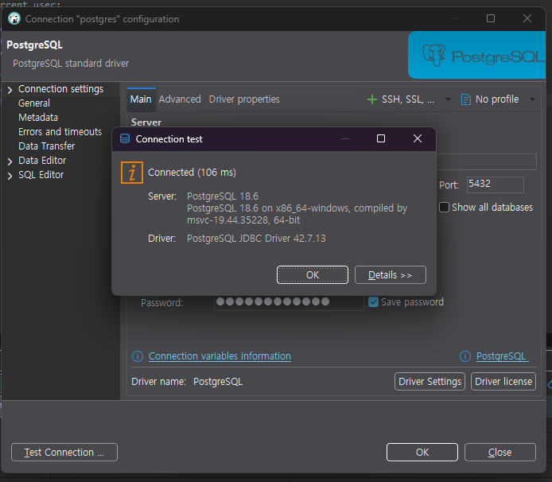
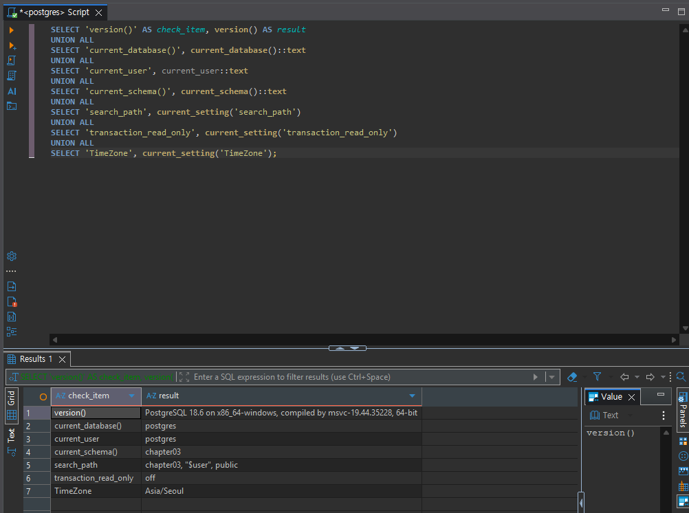
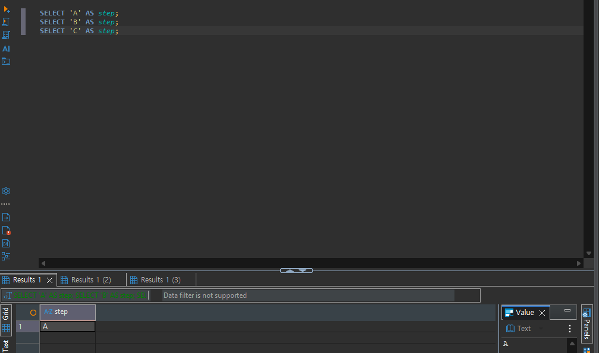

# Chapter 03 확장 실습 답안 템플릿

> **과제:** PostgreSQL과 DBeaver로 실습 환경 검증하기  
> **사용 방법:** 이 파일을 내려받아 본인의 GitHub 저장소에 `chapter03_answer.md`라는 이름으로 저장한 뒤 실습하면서 바로 작성합니다.  
> **제출 방법:** LMS에는 파일을 직접 업로드하지 않고, **본인 GitHub 저장소의 `chapter03_answer.md` 파일 URL**을 제출합니다.

---

## 제출 전 보안 주의

이 과제 파일과 캡처 화면에는 다음 정보를 올리지 않습니다.

```text
실제 PostgreSQL 비밀번호
전체 DB 접속 URL
API Key / Token
개인정보
공개할 필요가 없는 사내 서버 주소
```

LMS에서 제출자를 확인할 수 있으므로 공개 저장소의 답안 파일에 학번이나 실명을 반드시 적을 필요는 없습니다.

```text
GitHub 계정 또는 별칭: youccode
과제 작성일: 2026.09.22
사용한 AI 도구: chatgpt
```

---

# 1. PostgreSQL과 DBeaver 환경 확인

## 1-1. 내 환경

| 항목 | 작성 내용 |
| --- | --- |
| 운영체제 | Windows 11 |
| PostgreSQL 버전 | PostgreSQL 18.6 on x86_64-windows, compiled by msvc-19.44.35228, 64-bit |
| DBeaver 버전 | 26.2.0.202608301738 |
| Host | localhost |
| Port | 5432 |
| Database | postgres |
| Username | postgres |

> 비밀번호는 기록하지 않습니다.

## 1-2. PostgreSQL과 DBeaver 역할 설명

```text
PostgreSQL은: 실제로 데이터를 저장하고 관리하며, SQL 명령을 실제로 처리하는 DBMS를 말한다.

DBeaver는: PostgreSQL과 같은 데이터베이스에 연결하여 SQL을 작성하고 실행하며, 데이터 및 테이블 등을 편리하게 확인할 수 있도록 도와주는 데이터베이스 관리 도구를 말한다.

두 프로그램의 차이는: PostgreSQL은 실제 데이터를 저장하고, SQL을 처리하는 데이터베이스 서버이고, DBeaver는 PostgreSQL에 접속하여 데이터베이스를 쉽게 사용하고 관리할 수 있도록 도와주는 프로그램이라는 점이다.
```

---

# 2. 연결 테스트와 첫 SQL

## 2-1. DBeaver 연결 결과

- [x] PostgreSQL 연결 유형 선택
- [x] Host 확인
- [x] Port 확인
- [x] Database 확인
- [x] Username 확인
- [x] Test Connection 성공

### 연결 성공 화면

권장 이미지 경로:

```text
assignments/chapter03/images/step02_connection.png
```



## 2-2. 첫 SQL 실행

```sql
SELECT 1 + 1 AS result;
```

실행 전 예상:

```text
2
```

실제 결과:

```text
2
```

이 결과가 의미하는 것:

```text
DBeaver에서 작성한 SQL이 PostgreSQL 서버에 정상적으로 전달되었고,
PostgreSQL이 SQL을 실행한 결과를 다시 DBeaver로 정상적으로 전송한 것을 확인할 수 있다는 의미이다.
```

---

# 3. 현재 연결 위치를 SQL로 검증

다음 SQL을 실행합니다.

```sql
SELECT version();
SELECT current_database();
SELECT current_user;
SELECT current_schema();
SHOW search_path;
SHOW transaction_read_only;
SHOW TimeZone;
```

## 3-1. 결과 기록

| 확인 항목 | 실제 결과 | 내가 이해한 의미 |
| --- | --- | --- |
| `version()` | PostgreSQL 18.6 on x86_64-windows, compiled by msvc-19.44.35228, 64-bit | 현재 사용 중인 PostgreSQL 서버의 버전과 환경 정보를 보여준다. |
| `current_database()` | postgres | 현재 연결되어 있는 데이터베이스의 이름을 보여준다. |
| `current_user` | postgres | 현재 PostgreSQL에 접속해서 SQL을 실행하고 있는 사용자를 보여준다. |
| `current_schema()` | chapter03 | 현재 기본적으로 사용되는 스키마를 보여준다. |
| `search_path` | chapter03, "$user", public | 스키마 이름을 생략했을 때 PostgreSQL이 객체를 찾는 순서를 보여준다. |
| `transaction_read_only` | off | 현재 트랜잭션이 읽기 전용인지 여부를 보여준다. |
| `TimeZone` | Asia/Seoul | 현재 데이터베이스 세션에서 사용하는 시간대를 보여준다. |

## 3-2. 반드시 설명할 것

### DBeaver 연결 이름과 `current_database()`는 왜 같은 개념이 아닌가요?

```text
DBeaver의 연결 이름은 사용자가 연결을 구분하기 위해 정한 표시 이름이고,
current_database()는 PostgreSQL 서버에서 현재 실제로 연결되어 있는
데이터베이스의 이름을 반환한다. 따라서 DBeaver에 보이는 연결 이름만으로
현재 데이터베이스를 판단하지 않고 SQL로 직접 확인해야 한다.
```

### `current_schema()`와 `search_path`는 어떤 관계가 있나요?

```text
search_path는 PostgreSQL이 테이블이나 객체를 찾을 때 확인하는 스키마의 순서를 나타내고,
current_schema()는 그 search_path에서 현재 실제로 사용할 수 있는 첫 번째 스키마를 나타낸다.
따라서 search_path는 여러 스키마의 검색 순서이고, current_schema()는 그중 현재 기본 스키마를 나타낸다는 차이가 있다.
```

### `transaction_read_only = off`라는 결과만으로 모든 테이블을 만들 권한이 있다고 단정할 수 있나요?

```text
아니다. transaction_read_only가 off라는 것은 현재 트랜잭션이
읽기 전용 상태가 아니라는 의미일 뿐이다.

실제로 테이블을 생성하거나 수정할 수 있는지는 데이터베이스와 스키마에 대한
CREATE 권한이나 각 객체에 대한 권한을 별도로 확인해야 한다.
따라서 off라는 결과만으로 모든 테이블을 만들 수 있다고 단정할 수 없다.
```

## 3-3. 증거 화면

권장 경로:

```text
assignments/chapter03/images/step03_location_check.png
```



---

# 4. `ai_database_book` 데이터베이스 확인

## 4-1. 현재 데이터베이스

```sql
SELECT current_database();
```

실제 결과:

```text
ai_database_book
```

- [x] 결과가 `ai_database_book`이다.
- [x] 다른 DB라면 올바른 연결로 전환했다.

## 4-2. 연결을 바꾼 뒤 다시 검증

```text
전환 전 데이터베이스: postgres
전환 후 데이터베이스: ai_database_book
전환 여부를 판단한 근거: 기존 환경에서 ai_database_book 데이터베이스가 존재하지 않는 것을 확인하여 데이터베이스를 생성한 뒤 
해당 데이터베이스를 대상으로 새 연결을 만들었다. 이후 SELECT current_database();를 다시 실행했고,
결과가 postgres에서 ai_database_book으로 변경된 것을 확인했다.
```

### 화면에서 보이는 연결 이름만 믿지 않고 SQL을 다시 실행해야 하는 이유

```text
DBeaver에 표시되는 연결 이름은 사용자가 연결을 구분하기 위해 정한 이름이므로 실제로 접속된 데이터베이스 이름과 항상 같지는 않다.
따라서 SELECT current_database() 명령어를 실행해서 현재 실제로 연결된 데이터베이스를 SQL로 직접 확인해야 한다.
```

---

# 5. SQL 실행 범위 실험

SQL Editor에 다음 세 문장을 입력합니다.

```sql
SELECT 'A' AS step;
SELECT 'B' AS step;
SELECT 'C' AS step;
```

## 5-1. 한 문장 실행

```text
내가 실행한 문장: SELECT 'A' AS step;
실제 결과: A
```

## 5-2. 선택 영역 실행

```text
선택한 문장:
SELECT 'A' AS step;
SELECT 'B' AS step;

실제 결과:
A
B

2개의 결과가 서로 다른 탭에 나왔다.
```

## 5-3. 전체 스크립트 실행

```text
실제 결과: A, B, C가 모두 실행되었다.
결과 탭 또는 실행 순서에서 관찰한 점: 전체 스크립트를 실행하니 SQL Editor에 작성된 세 문장이 순서대로 모두 실행되었고 각각의 실행 결과를 확인할 수 있었다.
```

## 5-4. 결과 해석

```text
한 문장 실행과 전체 스크립트 실행의 차이: 한 문장 실행은 현재 커서가 위치한 하나의 SQL 문장만 실행하지만,
전체 스크립트 실행은 SQL Editor에 작성된 여러 SQL 문장을 순서대로 모두 실행한다.

변경 SQL에서 실행 범위를 잘못 선택하면 위험한 이유: UPDATE, DELETE와 같이 데이터를 변경하는 SQL이 포함되어 있을 때
실행 범위를 잘못 선택하면 실행하려고 하지 않았던 SQL까지 함께 실행되어 데이터가 수정되거나 삭제될 수 있기 때문에 위험하다.
따라서 실행하기 전에 어떤 SQL이 선택되어 있는지 확인해야 한다.
```

### 증거 화면

권장 경로:

```text
assignments/chapter03/images/step05_execution_scope.png
```



---

# 6. 제공된 환경 확인 SQL 실행

Public 저장소의 Chapter 03 파일을 사용합니다.

```text
code/chapter03/setup_check.sql
code/chapter03/setup_validate_local.sql
```

## 6-1. `setup_check.sql`

실행 결과에서 확인한 항목:

```text
PostgreSQL 버전: PostgreSQL 18.6 on x86_64-windows, compiled by msvc-19.44.35228, 64-bit
현재 DB: ai_database_book
현재 사용자: postgres
현재 스키마: public
search_path: public, "$user"
읽기 전용 여부: off
TimeZone: Asia/Seoul
1 + 1 결과: 2
public 스키마 존재 여부: true
public USAGE 권한: true
public CREATE 권한: true
```

### 이 파일을 여러 번 실행해도 비교적 안전한 이유

```text
setup_check.sql은 주로 SELECT와 SHOW처럼 현재 환경을 조회하는 SQL로
구성되어 있고, 데이터를 삭제하거나 변경하는 DELETE, UPDATE, DROP 등의
명령을 사용하지 않기 때문에 여러 번 실행해도 비교적 안전하다.
```

## 6-2. `setup_validate_local.sql`

```text
실행 결과: Chapter 03 recommended local environment validation passed
PASS / FAIL: PASS
```

실패했다면 실패 항목:

```text
없음
```

그 실패가 실제 문제인지 환경 차이인지 판단한 근거:

```text
검증 결과가 PASS였으므로 실패 항목이 없어 해당하지 않는다.
```

---

# 7. 안전한 오류 진단 실습

실제 오류가 있었다면 그 오류를 사용합니다. 오류가 없었다면 **데이터를 삭제하거나 서버를 강제로 중지하지 말고**, 안전한 SQL 문법 오류를 하나 만들어 관찰합니다.

예:

```sql
SELEC 1;
```

> 오류를 확인한 뒤 올바른 `SELECT 1;`로 복구합니다.

## 7-1. 오류 기록

```text
오류 메시지 핵심 문장:
SQL Error [42601]: 오류: 구문 오류, "SELEC" 부근
Position: 1
Error position: line: 1

내가 먼저 생각한 원인 1: SELECT 명령어의 철자를 잘못 입력했을 가능성이 있다고 생각했다.

내가 먼저 생각한 원인 2: DBeaver에서 SQL 실행 범위를 잘못 선택하여 완전하지 않은 문장이 실행되었을 가능성이 있다고 생각했다.

실제로 확인한 방법: SELEC 1;에서 SELEC를 SELECT로 수정한 뒤 다시 실행해 보았다.

실제 원인: SELECT 명령어에서 T가 빠져서 SQL 구문 오류가 발생했다.

수정한 내용: SELEC 1;을 SELECT 1;로 수정했다.
```

## 7-2. 수정 후 재검증

```sql
SELECT 1;
SELECT current_database();
```

```text
재검증 결과:
SELECT 1;은 정상적으로 실행되어 결과 1이 출력되었고,
SELECT current_database();의 결과로 ai_database_book이 출력되었다.
따라서 SQL 문법 오류가 수정되었고 데이터베이스 연결도 정상임을 확인했다.
```

## 7-3. 오류를 유형으로 분류

- [ ] 서버 실행 문제
- [ ] Host 문제
- [ ] Port 문제
- [ ] Database 문제
- [ ] Username/인증 문제
- [x] SQL 문법 문제
- [ ] 권한 문제
- [ ] 기타

선택 이유:

```text
PostgreSQL 서버와 데이터베이스 연결 자체에는 문제가 없었고, SELEC를 SELECT로 수정하자 SQL이 정상적으로 실행되었다.
따라서 이번 오류는 연결 문제가 아니라 SQL 명령어의 철자 오류로 인해 발생한 문법 문제라고 생각하였다.
```

---

# 8. AI를 오류 분석 보조 도구로 사용

## 8-1. AI에게 전달한 프롬프트

비밀번호·개인정보·전체 접속 URL은 제거하고 기록합니다.

```text
DBeaver에서 PostgreSQL을 사용하고 있습니다.

SELEC 1;

을 실행했더니 다음 오류가 발생했습니다.

SQL Error [42601]: 오류: 구문 오류, "SELEC" 부근
Position: 1
Error position: line: 1

이 오류의 가능한 원인과 확인 방법을 알려주세요.
```

## 8-2. AI 답변 검토

| AI가 제안한 확인 방법 | 실제로 확인했는가? | 결과 | 수용 / 수정 / 거절 |
| --- | --- | --- | --- |
| `SELEC`가 `SELECT`의 오타인지 확인 | 예 | `SELECT`에서 `T`가 빠진 것을 확인했다. | 수용 |
| `SELEC 1;`을 `SELECT 1;`로 수정해서 실행 | 예 | 오류 없이 정상 실행되고 결과 `1`이 출력되었다. | 수용 |
| 오류가 발생한 위치인 `Error position` 주변 확인 | 예 | `Position: 1`이었고 첫 번째 키워드인 `SELEC`에서 오류가 발생한 것을 확인했다. | 수용 |

### AI가 오류 원인을 너무 빨리 단정한 부분이 있었나요?

```text
이번 경우에는 오류 메시지에서 "SELEC" 부근에 구문 오류가 있다고 명확하게 표시되어 있었고 SQL 코드도 매우 짧았기 때문에,
AI가 SELECT의 오타라고 바로 판단한 것이 크게 문제라고 느껴지지는 않았다.

다만 SQL이 더 길고 복잡한 경우에는 오류가 표시된 위치와 실제 원인이
다를 수도 있기 때문에 바로 한 가지 원인으로 단정해서는 안 될 것 같다.
```

### 오류 메시지와 실제 환경 중 무엇을 확인해서 최종 판단했나요?

```text
이번에는 오류 메시지를 보고 판단했다.

오류 메시지에 "구문 오류, SELEC 부근"이라고 직접 표시되어 있었고,
Position: 1이라고 오류 위치까지 알려주고 있었기 때문에
첫 번째 키워드인 SELEC가 잘못된 부분이라는 것을 쉽게 확인할 수 있었다.

따라서 SELECT의 철자 오류로 인해 발생한 SQL 문법 오류라고 판단했다.
```

### AI 활용에서 가장 유용했던 점

```text
이번 오류는 SQL 코드가 매우 짧고 오류 위치도 명확하게 표시되어 있어서
AI의 도움 없이도 비교적 쉽게 원인을 찾을 수 있었다.

하지만 실제로 더 길고 복잡한 SQL을 작성하다가 오류가 발생하면
어느 부분에서 문제가 발생했는지 직접 찾는 데 시간이 오래 걸릴 수 있기 때문에,
그런 경우에는 AI를 활용해서 오류 메시지와 코드를 같이 분석하는 것이
더 큰 도움이 될 것이라고 생각했다.
```

### AI 답변을 그대로 실행하지 않고 확인해야 하는 이유

```text
이번처럼 코드가 짧고 오류가 명확한 경우에는 AI의 답변이 맞는지 직접 확인하는 것도 어렵지 않았다.

하지만 SQL이 길어지고 여러 테이블이나 조건이 포함되면 AI가 코드의 전체 상황을 
정확하게 이해하지 못하거나 실제 원인과 다른 수정 방법을 제안할 수도 있다고 생각한다.

그래서 AI의 답변은 오류를 찾는 데 참고하는 용도로 사용하고,
제안한 내용을 실제 SQL에서 실행해 보면서 정상적으로 동작하는지
직접 확인하는 것이 필요하다고 생각한다.
```

---

# 9. Chapter 01~02 개인 서비스와 연결

앞에서 선택한 개인 서비스가 PostgreSQL을 사용한다고 가정합니다.

```text
서비스 이름: 논문 인용 관계 탐색 서비스

사용할 데이터베이스 이름 후보: paper_citation_db

사용할 스키마 이름 후보: citation_core

앞으로 만들고 싶은 테이블 후보 3개:
1. papers
2. authors
3. citations
```

### 아직 SQL을 만들지 않고 이름과 역할만 정하는 이유

```text
아직 논문의 동일성을 어떤 기준으로 판단할지,
arXiv 버전과 학회 또는 저널 출판본을 같은 논문으로 볼지,
citation 관계를 단순한 논문 간 연결로 저장할지 실제 인용 위치까지 저장할지
정해지지 않은 부분이 있기 때문이다.

이런 정책이 확정되지 않은 상태에서 바로 SQL로 테이블 구조를 만들면
나중에 서비스 요구사항이 구체화되었을 때 테이블이나 관계를 다시 크게
수정해야 할 수 있다.

따라서 현재 단계에서는 먼저 어떤 데이터를 관리할지와 각 테이블이 어떤 역할을 가질지만 정하고,
구체적인 열이나 제약 조건은 이후에 결정하는 것이 적절하다고 생각한다.
```

### Chapter 02에서 정리했던 한 행의 의미 중 수정할 부분이 있나요?

```text
수정할 부분이 있다.

Chapter 02에서는 papers의 한 행을 하나의 논문 또는 하나의 출판 버전이라고
정리했지만, 아직 arXiv 버전과 학회 또는 저널 출판본을 같은 논문으로
처리할지 별개의 논문으로 저장할지가 확정되지 않았다.

따라서 papers의 한 행이 정확히 어떤 범위의 논문을 의미하는지는
서비스 정책을 더 정한 뒤 확정할 필요가 있다.

또한 citations도 현재는 한 행을 한 논문이 다른 논문을 인용하는 관계
한 건으로 생각하고 있지만, 나중에 실제 인용 문장이나 위치까지 저장하게 된다면
같은 두 논문 사이에서도 여러 인용이 존재할 수 있으므로
한 행의 의미를 다시 구분해야 할 수 있다.
```

---

# 10. 초보자용 연결 가이드 작성

친구가 자신의 PC에서 같은 실습을 시작한다고 가정합니다. 아래 순서를 자신의 말로 작성합니다.

```text
1. PostgreSQL 서버가 실행되는지 확인하는 방법: DBeaver에서 기존 PostgreSQL 연결에 Test Connection을 실행하거나,
연결 후 SELECT 1; 같은 간단한 SQL이 정상적으로 실행되는지 확인한다.

2. DBeaver에서 PostgreSQL 연결을 만드는 방법: DBeaver에서 새 Database Connection을 만들고 PostgreSQL을 선택한 뒤,
Host, Port, Database, Username, Password를 입력하고 Test Connection으로 연결이 되는지 확인한 다음 연결을 생성한다.

3. Host / Port / Database / Username의 의미: Host는 PostgreSQL 서버가 실행되는 위치이고, Port는 해당 PostgreSQL 서버에 접속할 때 사용하는 포트 번호이다.
Database는 서버 안에서 접속할 데이터베이스의 이름이고, Username은 PostgreSQL에 접속할 때 사용하는 사용자 계정이다.

4. ai_database_book에 연결되었는지 확인하는 방법: DBeaver에 표시되는 연결 이름만 보고 판단하지 않고
SELECT current_database();를 실행한다. 결과가 ai_database_book이면 해당 데이터베이스에 연결된 것이다.

5. 현재 위치를 확인하는 SQL:
SELECT current_database();
SELECT current_user;
SELECT current_schema();
SHOW search_path;

6. 한 문장과 전체 스크립트 실행을 구분해야 하는 이유: 한 문장 실행은 원하는 SQL 하나만 실행하지만, 전체 스크립트 실행은 작성된 여러 SQL을 모두 실행한다.
SELECT만 있는 경우에는 큰 문제가 없을 수 있지만, UPDATE나 DELETE 같은 변경 SQL이 포함된 경우에는 원하지 않는 SQL까지
실행될 수 있으므로 실행 범위를 확인해야 한다.

7. 비밀번호를 GitHub나 AI 프롬프트에 넣으면 안 되는 이유: GitHub에 비밀번호를 올리면 다른 사람이 확인할 수 있고,
AI에게 질문할 때도 오류 해결에 필요하지 않은 실제 비밀번호나 전체 접속 정보를 전달할 이유가 없다.
따라서 필요한 오류 메시지와 SQL만 제공하고 민감한 접속 정보는 제외해야 한다.
```

---

# 11. 최종 성찰

아래 문장은 반드시 본인의 말로 작성합니다.

```text
1. DBeaver와 PostgreSQL의 가장 중요한 차이는
   DBeaver는 PostgreSQL에 접속해 SQL을 작성하고 실행하는 도구이고, PostgreSQL은 실제 데이터를 저장하고 SQL을 처리하는 DBMS라는 점이다.

2. 내가 지금 어느 데이터베이스에 연결되어 있는지 확인할 때
   화면 이름만 보지 않고 SELECT current_database();를 실행해서 실제 연결된 데이터베이스를 확인해야 한다.

3. PostgreSQL 오류가 발생했을 때 가장 먼저 해야 할 일은
   오류 메시지와 오류가 발생한 위치를 확인해서 원인을 파악하는 것이다.

4. AI를 오류 해결에 사용할 때 가장 중요한 것은
   AI의 답변을 그대로 믿지 않고 실제 오류 메시지와 SQL 실행 결과를 통해 확인하는 것이다.
```

---

# 12. 제출 체크리스트

- [x] `chapter03_answer.md`의 빈 필수 항목을 작성했다.
- [x] PostgreSQL과 DBeaver의 역할 차이를 설명했다.
- [x] `current_database/current_user/current_schema/search_path`를 실제로 확인했다.
- [x] `ai_database_book` 연결 여부를 SQL로 검증했다.
- [x] SQL 실행 범위 세 가지를 비교했다.
- [x] `setup_check.sql`을 실행했다.
- [x] `setup_validate_local.sql` 결과를 확인했다.
- [x] 오류 원인을 먼저 스스로 추정한 뒤 AI를 사용했다.
- [x] AI 제안을 실제 환경에서 검증했다.
- [x] 핵심 캡처 3~4장만 골라 넣었다.
- [x] 캡처에 비밀번호·개인정보·전체 접속 URL이 없다.
- [x] Markdown 이미지가 GitHub 웹 화면에서 실제로 보인다.
- [x] 최종 답안 파일을 commit/push했다.

---

# 13. LMS 제출 URL

아래 형식의 **본인 GitHub 파일 URL**을 LMS에 제출합니다.

```text
https://github.com/<본인-GitHub-ID>/<본인-저장소>/blob/main/assignments/chapter03/chapter03_answer.md
```

내 제출 URL:

```text
https://github.com/youccode/database-course-2026-2/blob/main/assignments/chapter03/chapter03_answer.md
```

> 저장소 메인 URL, 교수자 템플릿 URL, Raw URL이 아니라 **작성 완료된 본인 `chapter03_answer.md` 파일 화면 URL**을 제출합니다.
