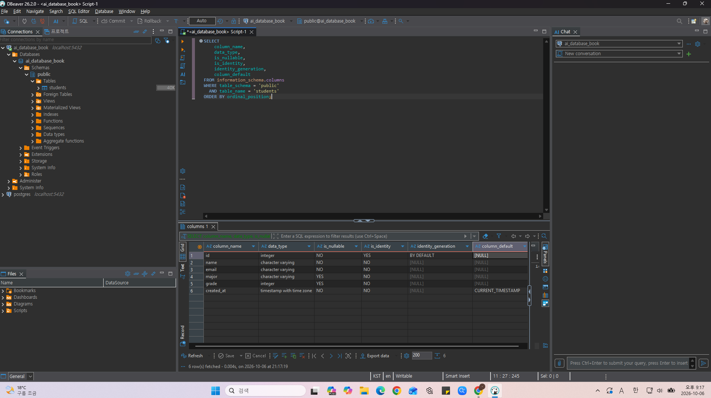
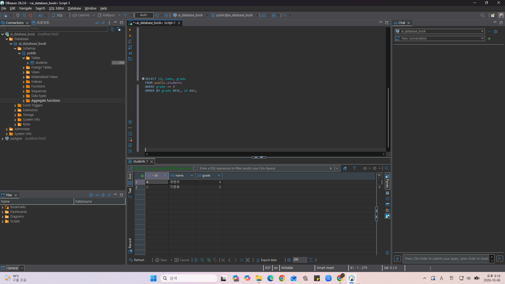
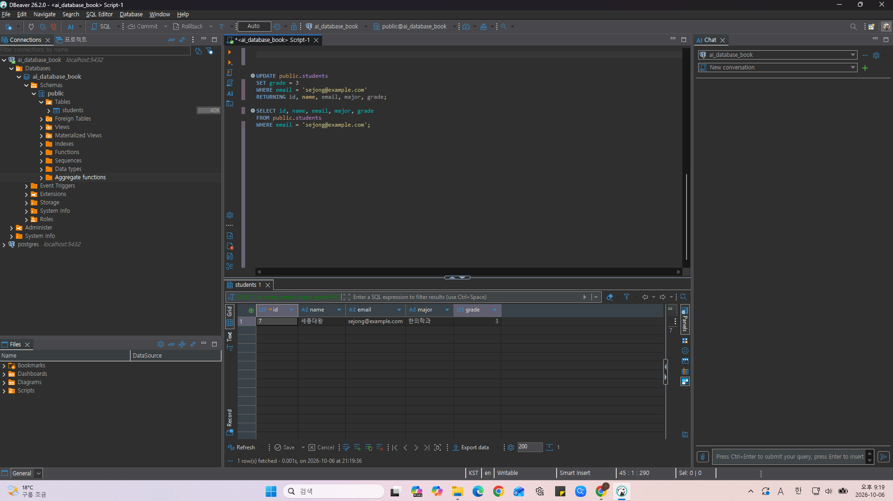
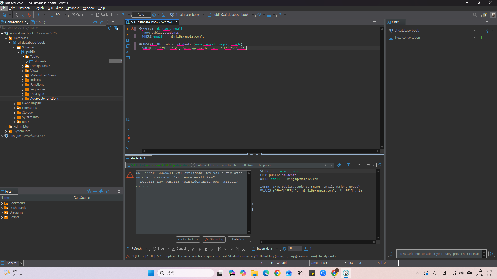

# Chapter 04 확장 실습 답안 템플릿

> **과제:** 관계형 데이터베이스와 SQL 시작하기  
> **사용 방법:** 이 파일을 내려받아 본인의 GitHub 저장소에 `chapter04_answer.md`라는 이름으로 저장한 뒤 실습하면서 바로 작성합니다.  
> **제출 방법:** LMS에는 파일을 직접 업로드하지 않고, **본인 GitHub 저장소의 `chapter04_answer.md` 파일 URL**을 제출합니다.

---

## 제출 전 주의

이 파일과 캡처 화면에는 실제 비밀번호, 전체 DB 접속 URL, API Key, 개인정보를 기록하지 않습니다.

```text
GitHub 계정 또는 별칭: youccode
과제 작성일: 2026.10.05
사용한 AI 도구: chatgpt
```

---

# 1. 실습 환경과 시작 상태 확인

다음을 실행합니다.

```sql
SELECT current_database();
SELECT current_user;
SELECT current_schema();
SHOW search_path;
SHOW transaction_read_only;
```

| 확인 항목 | 실제 결과 | 의미 |
| --- | --- | --- |
| current_database() | ai_database_book | 현재 SQL을 실행하고 있는 데이터베이스의 이름이다. |
| current_user | postgres | 현재 PostgreSQL에 접속하여 SQL을 실행하고 있는 사용자이다. |
| current_schema() | public | 현재 기본적으로 사용되는 스키마이다. |
| search_path | public, "$user" | 스키마 이름을 생략했을 때 PostgreSQL이 객체를 찾는 스키마의 순서이다. |
| transaction_read_only | off | 현재 트랜잭션이 읽기 전용 상태가 아니라는 의미이다. 다만 실제 객체를 변경할 권한이 있는지는 별도의 권한 확인이 필요하다. |

- [x] 현재 DB가 `ai_database_book`이다.
- [x] 변경 가능한 연결인지 확인했다.
- [x] 실행할 SQL 범위를 확인했다.
- [x] Auto-commit 상태를 확인했다.

### 변경 SQL을 실행하기 전에 현재 DB와 실행 범위를 확인해야 하는 이유

```text
UPDATE, DELETE와 같은 변경 SQL은 문법이 정상이어도 잘못된 데이터베이스나
의도하지 않은 행을 대상으로 실행하면 실제 데이터가 변경될 수 있다.

따라서 실행 전에 현재 연결된 데이터베이스가 맞는지 확인하고,
선택한 SQL 문장이나 실행 범위가 내가 실행하려는 부분과 일치하는지
확인해야 한다.
```

---

# 2. `public.students` 구조 생성

## 2-1. 실행 전 예상

```text
테이블 이름: public.students
한 행의 의미: 학생 한 명을 의미함.
예상 행 수: 0
기본키: id
필수 열: id, name, email, created_at
중복을 막는 열: email
자동 생성 열: id, created_at
```

## 2-2. 실행 파일

```text
code/chapter04/01_create_students.sql
```

## 2-3. 실행 후 확인

```text
테이블 생성 성공 여부: 성공
실제 행 수: 0
DBeaver에서 확인한 위치: ai_database_book > Schemas > public > Tables > students
```

### 각 열의 역할

| 열 | 타입 | NULL 가능? | 역할 |
| --- | --- | --- | --- |
| id | INTEGER | 불가 | 학생 한 명을 DB 내부에서 구분하기 위한 기본키이며 값이 자동으로 생성된다. |
| name | VARCHAR(50) | 불가 | 학생의 이름을 저장한다. |
| email | VARCHAR(100) | 불가 | 학생의 이메일을 저장하며 UNIQUE 제약조건을 통해 중복 입력을 막는다. |
| major | VARCHAR(100) | 가능 | 학생의 전공을 저장하며 값이 없는 경우 NULL이 가능하다. |
| grade | INTEGER | 가능 | 학생의 학년을 저장하며 값이 없는 경우 NULL이 가능하다. |
| created_at | TIMESTAMPTZ | 불가 | 행이 생성된 시각을 저장하며 값을 직접 입력하지 않으면 현재 시각이 자동으로 저장된다. |

### `id`를 학번이나 학생 수로 해석하면 안 되는 이유

```text
id는 학생의 학번이나 전체 학생 수를 의미하는 값이 아니라
students 테이블 안에서 각 학생 행을 구분하기 위한 내부 식별자이다.

자동으로 생성되는 값이더라도 데이터 삭제나 INSERT 실패 등의 이유로
번호 사이에 빈 구간이 생길 수 있으므로 id 값 자체를 학번이나 학생 수로
해석하면 안 된다.
```

### 증거 화면

권장 경로:

```text
assignments/chapter04/images/step02_table.png
```




---

# 3. 샘플 데이터 6명 입력

## 3-1. 실행 전 예상

```text
현재 행 수: 0
실행 후 예상 행 수: 6
예상되는 NULL 포함 학생: 윤서진
```

## 3-2. 실행 파일

```text
code/chapter04/02_insert_students.sql
```

## 3-3. 실제 결과

```text
실제 행 수: 6
이준호 grade: 3
박서연 존재 여부: 존재함(1행)
윤서진 major: NULL
윤서진 grade: NULL
```

### 예상과 실제 비교

```text
예상과 실제가 일치했는가: 일치했다.
다르다면 이유: 해당 없음
```

### `created_at` 값이 여러 행에서 같을 수 있는 이유

```text
샘플 학생 6명은 하나의 트랜잭션 안에서 입력되고,
CURRENT_TIMESTAMP는 해당 트랜잭션의 시작 시각을 기준으로 값을 반환할 수 있다.

따라서 여러 학생이 서로 다른 INSERT 문으로 입력되었더라도
같은 트랜잭션 안에서 처리되었다면 created_at 값이 같을 수 있다.
```

---

# 4. SELECT 복습과 결과 검증

각 문제는 **SQL 실행 전에 예상 행 수를 먼저 작성**합니다.

| 번호 | 조회 문제 | 예상 행 수 | 실제 행 수 | 일치? | 다르면 이유 |
| ---: | --- | ---: | ---: | --- | --- |
| 1 | 전체 학생 | 6 | 6 | 일치 | 해당 없음 |
| 2 | 이름·이메일만 조회 | 6 | 6 | 일치 | 해당 없음 |
| 3 | 특정 전공 | 2 | 2 | 일치 | 해당 없음 |
| 4 | 특정 학년 이상 | 2 | 2 | 일치 | 해당 없음 |
| 5 | 두 전공 중 하나 | 3 | 3 | 일치 | 해당 없음 |
| 6 | `grade IS NULL` | 1 | 1 | 일치 | 해당 없음 |
| 7 | 전공 `DISTINCT` | 4 | 4 | 일치 | 해당 없음 |
| 8 | 정렬 후 상위 3명 | 3 | 3 | 일치 | 해당 없음 |

## 4-1. 내가 직접 작성한 SQL 2개

### 질문 1

```text
질문: 2학년 또는 3학년인 학생은 누구인가?
```

```sql
-- SQL 1
SELECT id, name, grade
FROM public.students
WHERE grade IN (2, 3)
ORDER BY id ASC;
```

```text
이 SQL의 한 행 의미: 학년이 2학년 또는 3학년인 학생 한 명을 의미한다.
예상 행 수: 3
실제 행 수: 3
```

```text
결과 해석: 김민지, 이준호, 정하늘 총 3명이 조회되었으며 예상한 행 수와 일치했다.
```

### 질문 2

```text
질문: 이메일을 내림차순으로 정렬했을 때 앞의 4명은 누구인가?
```

```sql
-- SQL 2
SELECT id, name, email
FROM public.students
ORDER BY email DESC
LIMIT 4;
```

```text
이 SQL의 한 행 의미: 이메일을 내림차순으로 정렬했을 때 상위 4명에 포함된 학생 한 명을 의미한다.
예상 행 수: 4
실제 행 수: 4
```

```text
결과 해석: 박서연, 윤서진, 김민지, 이준호 총 4명이 조회되었으며 예상한 행 수와 일치했다.
```

## 4-2. `= NULL` 대신 `IS NULL`을 사용하는 이유

```text
NULL은 값이 없거나 알 수 없는 상태를 의미하기 때문에 일반적인 값처럼
"=" 연산자로 비교할 수 없다. 따라서 어떤 값이 NULL인지 확인하려면 = NULL이 아니라
IS NULL을 사용해야 한다.
```

## 4-3. `ORDER BY` 없이 결과 순서를 믿으면 안 되는 이유

```text
ORDER BY를 지정하지 않은 SELECT 결과의 행 순서는 보장되지 않는다.

현재 조회했을 때 일정한 순서로 보이더라도 데이터 상태나 실행 방식에 따라
다른 순서로 반환될 수 있으므로 결과의 순서가 중요하다면
ORDER BY를 사용해서 정렬 기준을 명확하게 지정해야 한다.
```

## 4-4. `DISTINCT`가 원본 데이터를 삭제하는 기능인가요?

```text
아니다.

DISTINCT는 SELECT 결과에서 중복된 값을 제거해서 보여주는 기능이며,
원본 테이블에 저장되어 있는 데이터를 삭제하거나 변경하지 않는다.
```

### 증거 화면

권장 경로:

```text
assignments/chapter04/images/step04_select.png
```



---

# 5. 내 가상 학생 2명 추가

실명·실제 이메일 대신 가상 데이터를 사용합니다.

## 5-1. 실행 전 계획

```text
학생 A
이름: 세종대왕
이메일: sejong@example.com
전공: 한의학과
학년: 2

학생 B
이름: 김구
이메일: kimgu@example.com
전공: 수학과
학년 또는 NULL: NULL

현재 행 수: 6
추가 후 예상 행 수: 8
```

## 5-2. 내가 실행한 INSERT

```sql
INSERT INTO public.students (name, email, major, grade)
VALUES
    ('세종대왕', 'sejong@example.com', '한의학과', 2),
    ('김구', 'kimgu@example.com', '수학과', NULL)
RETURNING id, name, email, major, grade;
```

## 5-3. 실제 결과

```text
RETURNING 또는 확인 SELECT 결과: 세종대왕과 김구가 각각 1행씩 정상적으로 추가된 것을 확인했다.
실제 전체 행 수: 8
예상과 일치 여부: 일치
```

### 내가 일부 값을 NULL로 둔 이유 또는 NULL을 사용하지 않은 이유

```text
김구의 학년은 아직 정해지지 않은 값이라고 가정하여 grade를 NULL로 두었다.

NULL은 0이나 빈 문자열을 의미하는 것이 아니라 현재 값이 없거나 알 수 없는
상태를 나타내므로, 임의의 학년 값을 넣는 것보다 NULL로 저장하는 것이
더 적절하다고 판단했다.
```

---

# 6. 안전한 UPDATE

내가 추가한 가상 학생 한 명만 수정합니다.

## 6-1. 먼저 대상 확인 SELECT

```sql
SELECT id, name, email, major, grade
FROM public.students
WHERE email = 'sejong@example.com';
```

```text
예상 대상 행 수: 1
실제 대상 행 수: 1
```

## 6-2. UPDATE

```sql
UPDATE public.students
SET grade = 3
WHERE email = 'sejong@example.com'
RETURNING id, name, email, major, grade;
```

```text
예상 영향 행 수: 1
실제 영향 행 수: 1
RETURNING 결과: 
id: 7
name: 세종대왕
email: sejong@example.com
major: 한의학과
grade: 3
```

## 6-3. UPDATE 후 재조회

```sql
SELECT id, name, email, major, grade
FROM public.students
WHERE email = 'sejong@example.com';
```

### `WHERE` 없는 UPDATE를 실행하면 위험한 이유

```text
WHERE 조건이 없는 UPDATE는 수정할 대상을 특정하지 않기 때문에
테이블에 있는 모든 행이 변경될 수 있다.

이번에는 email = 'sejong@example.com'이라는 조건을 사용해서
세종대왕 학생 1명만 수정했지만, WHERE 조건을 생략했다면
students 테이블의 모든 학생의 grade가 3으로 변경될 수 있다.

따라서 UPDATE를 실행하기 전에는 같은 WHERE 조건으로 SELECT를 먼저 실행해서
실제로 수정하려는 행만 선택되는지 확인하는 것이 필요하다.
```

### 증거 화면

권장 경로:

```text
assignments/chapter04/images/step06_update.png
```



---

# 7. 안전한 DELETE

내가 추가한 가상 학생 한 명을 삭제합니다.

## 7-1. 삭제 전 확인

```sql
SELECT id, name, email, major, grade
FROM public.students
WHERE email = 'kimgu@example.com';
```

```text
예상 대상 행 수: 1
실제 대상 행 수: 1
```

## 7-2. DELETE

```sql
DELETE FROM public.students
WHERE email = 'kimgu@example.com'
RETURNING id, name, email;
```

```text
예상 영향 행 수: 1
실제 영향 행 수: 1
RETURNING 결과: 
id: 8
name: 김구
email: kimgu@example.com
```

## 7-3. 삭제 후 재조회

```sql
SELECT id, name, email
FROM public.students
WHERE email = 'kimgu@example.com';
```

```text
삭제 후 같은 조건의 SELECT 결과 행 수: 0
```

### `DELETE` 성공 메시지만 보고 끝내지 않고 다시 SELECT해야 하는 이유

```text
DELETE가 정상적으로 실행되었다는 사실만으로 내가 의도한 행이 정확하게
삭제되었다고 단정할 수는 없다.

WHERE 조건을 잘못 작성했거나 예상과 다른 행이 영향을 받았을 수도 있기 때문에,
삭제 후 같은 조건으로 SELECT를 다시 실행하여 해당 학생이 더 이상 조회되지
않는지 직접 확인해야 한다.
```

---

# 8. 본문 기준 UPDATE·DELETE 상태 검증

`04_update_delete_students.sql`을 본문 시작 상태에서 실행했다면 다음을 확인합니다.

```text
최종 학생 수: 5
이준호 grade: 4
박서연 존재 여부: 존재하지 않음(0행)
```

본문 기준 기대 상태와 비교합니다.

```text
학생 수 = 5
이준호 grade = 4
박서연 = 0행
```

### 내 실제 결과가 기준과 다르다면 원인

```text
최종 결과는 본문 기준 기대 상태와 일치했으므로 해당 없음.

다만 가상 학생 추가 및 삭제 실습 이후에는 학생 수가 7명이었으므로,
본문 기준 UPDATE·DELETE SQL을 실행하기 전에 추가했던 세종대왕 학생을 삭제하여
학생 수 6명, 이준호 grade 3, 박서연 1행인 시작 상태로 다시 맞췄다.

그 후 04_update_delete_students.sql을 실행한 결과
학생 수는 5명, 이준호 grade는 4, 박서연은 0행으로 확인되었으며
본문에서 제시한 기대 상태와 모두 일치했다.
```

---

# 9. 의도한 실패 2개 관찰

> 실패 테스트는 데이터베이스 규칙이 실제로 데이터를 보호하는지 확인하는 실험입니다.

## 9-1. 중복 이메일 `UNIQUE` 오류

내가 사용한 SQL:

```sql
INSERT INTO public.students (name, email, major, grade)
VALUES ('중복테스트학생', 'minji@example.com', '테스트학과', 1);
```

```text
오류 메시지 핵심 단서: SQL Error [23505]: 오류: 중복된 키 값이 "students_email_key" 고유 제약 조건을 위반함
Detail: (email)=(minji@example.com) 키가 이미 있습니다.
왜 실패해야 맞는가: minji@example.com 이메일은 이미 기존 학생이 사용하고 있기 때문에
같은 이메일을 다시 저장하면 email 열의 중복 금지 규칙에 위배된다.
어떤 규칙이 작동했는가: email 열에 설정된 UNIQUE 제약조건이 작동했다.
실패 후 기존 데이터가 어떻게 유지되었는가: 같은 이메일로 다시 SELECT한 결과 기존 김민지 학생 1행만 조회되었고,
중복 이메일을 가진 새로운 학생은 추가되지 않았다.
```

## 9-2. 이름 `NULL` 입력 `NOT NULL` 오류

내가 사용한 SQL:

```sql
INSERT INTO public.students (name, email, major, grade)
VALUES (NULL, 'null_name_test@example.com', '테스트학과', 1);
```

```text
오류 메시지 핵심 단서: SQL Error [23502]: 오류: "name" 칼럼(해당 릴레이션 "students")의 null 값이 not null 제약조건을 위반했습니다.
Detail: 실패한 자료: (10, null, null_name_test@example.com, 테스트학과, 1, 2026-10-05 19:09:28.970853+09)
왜 실패해야 맞는가: name 열은 반드시 값이 있어야 하는 열인데 NULL을 입력하려 했기 때문에
INSERT가 실패해야 한다.
어떤 규칙이 작동했는가: name 열에 설정된 NOT NULL 제약조건이 작동했다. 
```

### 실패한 INSERT 뒤 자동 생성 `id` 번호에 빈 구간이 생길 수 있어도 문제라고 단정할 수 없는 이유

```text
id는 학생 수나 반드시 연속되어야 하는 번호가 아니라 각 행을 구분하기 위한 내부 식별자이다.

INSERT를 시도하는 과정에서 자동 생성 id가 먼저 할당된 뒤
UNIQUE나 NOT NULL 같은 제약조건 때문에 INSERT가 실패할 수도 있다.

따라서 실패한 INSERT 이후 id 번호 사이에 빈 구간이 생기더라도
그 자체만으로 데이터에 문제가 있다고 판단할 수 없다.
```

### 증거 화면

권장 경로:

```text
assignments/chapter04/images/step09_constraint_error.png
```



---

# 10. `verify_students.sql`로 최종 상태 확인

실행 파일:

```text
code/chapter04/verify_students.sql
```

```text
현재 전체 학생 수: 5
NULL 개수: major NULL = 1, grade NULL = 1
이준호 grade: 4
박서연 존재 여부: 존재하지 않음(false)
현재 데이터 상태에서 예상과 다른 부분: 없음
```

### 검증 SQL을 따로 두면 좋은 이유

```text
실습 과정에서 SQL이 정상적으로 실행되었더라도 최종 데이터가
예상한 상태와 정확히 일치하는지는 별도로 확인할 필요가 있다.

검증 SQL을 따로 두면 전체 행 수, NULL 값, 특정 학생의 상태 등을
한 번에 다시 확인할 수 있고, 실습 중 데이터가 예상과 다르게 변경되었는지도
쉽게 확인할 수 있다.
```

---

# 11. AI를 SQL 작성자가 아니라 검토자로 활용

먼저 본인이 SQL을 작성한 뒤 AI에게 검토를 요청합니다.

## 11-1. 내가 작성한 SQL

```sql
UPDATE public.students
SET grade = 4
WHERE email = 'junho@example.com'
RETURNING id, name, email, grade;
```

## 11-2. AI에게 전달한 핵심 요청

```text
내가 먼저 작성한 UPDATE SQL을 바로 수정해서 새로 작성하지 말고,
실행 전에 안전성을 검토해 달라고 요청했다.

특히 예상 영향 행 수, WHERE 조건의 안전성, NULL 처리,
실행 전후 확인을 위한 SELECT, 그리고 놓친 위험이 있는지를
순서대로 검토해 달라고 요청했다.
```

## 11-3. AI 검토 결과

| AI 제안 | 수용 / 수정 / 거절 | 실제 검증 결과 | 나의 이유 |
| --- | --- | --- | --- |
| `email`이 UNIQUE이고 WHERE 조건이 특정 이메일을 지정하므로 예상 영향 행 수는 1행이라고 판단 | 수용 | 실제 대상과 UPDATE 결과 모두 1행이었다. | email이 UNIQUE이므로 같은 이메일을 가진 여러 행이 동시에 선택되지 않고, 실제 조회에서도 이준호 1명만 확인되었다. |
| UPDATE 실행 전에 같은 WHERE 조건으로 SELECT하여 대상 행을 먼저 확인하고, 실행 후에도 다시 SELECT하여 결과를 확인 | 수용 | 실행 전후 모두 이준호 1행이 조회되었고 최종 grade는 4였다. | 변경 SQL을 실행하기 전에 대상을 확인하고 실행 후 실제 데이터 상태를 다시 확인하는 방법이 안전하다고 판단했다. |
| 현재 grade가 이미 4이므로 실제 값은 바뀌지 않지만 UPDATE 대상 행으로 처리될 수 있고 트리거나 감사 기능이 있다면 부수 효과가 있을 수 있음 | 수용 | 현재 실습에서는 최종 grade가 그대로 4인 것을 확인했다. | 같은 값을 다시 저장하더라도 UPDATE 자체는 실행될 수 있으므로 실제 환경에서는 부수 효과가 있는지 확인할 필요가 있다고 생각했다. |

### AI가 예상한 영향 행 수와 실제 결과가 같았나요?

```text
동일했다. AI는 email 열이 UNIQUE이고 WHERE 조건이 junho@example.com으로 특정되어 있으므로
1행이 영향을 받을 것으로 예상했다.

실제로 실행 전 SELECT에서 이준호 학생 1행이 조회되었고, UPDATE도 해당 학생 1행을 대상으로 실행되었다.
실행 후 다시 SELECT한 결과 이준호 학생이 1행 조회되었으며 grade는 4였다.

따라서 AI가 예상한 영향 행 수와 실제 실행 결과가 일치했다.
```

### AI 답변을 실행 전에 검토해야 하는 이유

```text
AI가 제안한 SQL이나 판단이 항상 현재 데이터베이스의 실제 상태와 정확하게 일치한다고 보장할 수 없기 때문이다.

특히 UPDATE나 DELETE 같은 변경 SQL은 WHERE 조건을 잘못 판단하면 의도하지 않은 행까지 변경할 수 있으므로, 
AI의 설명을 바로 실행하기보다 현재 데이터와 대상 행 수를 먼저 SELECT로 확인해야 한다.

또한 AI가 예상한 영향 행 수와 실제 실행 결과를 비교해서 제안이 현재 환경에서도 맞았는지 직접 검증하는 과정이 필요하다.
```

---

# 12. 내 서비스 테이블 하나 확장 설계

Chapter 01~03에서 정한 개인 서비스에서 **테이블 하나**를 선택합니다.

```text
서비스 이름: 논문 인용 관계 탐색 서비스
테이블 이름: papers
한 행의 의미: 서비스에서 관리하는 논문 기록 한 건을 의미한다. 다만 arXiv 버전과 학회 또는 저널 출판본을 같은 행으로 관리할지는 아직 미확정이다.
```

| 열 이름 | 저장할 값 | 타입 후보 | NULL 가능? | UNIQUE 후보? | 이유 |
| --- | --- | --- | --- | --- | --- |
| paper_id | 데이터베이스 내부 논문 식별자 | BIGINT | 불가 | 해당 없음 (PK로 고유성 보장) | 각 논문 행을 데이터베이스 내부에서 안정적으로 구분하기 위해 사용한다. |
| title | 논문 제목 | TEXT | 불가 | 아니오 | 논문을 표시하는 데 기본적으로 필요한 정보이지만 같은 제목의 논문이 존재할 수 있다. |
| doi | DOI 식별자 | VARCHAR(255) | 가능 | 후보 | DOI가 없는 논문도 있으며 DOI의 저장 형식과 동일성 판단 규칙이 아직 확정되지 않았다. |
| arxiv_id | arXiv 식별자 | VARCHAR(50) | 가능 | 후보 | 모든 논문이 arXiv에 등록되는 것은 아니며 버전 번호와 출판본의 관계를 어떻게 처리할지 아직 결정되지 않았다. |
| published_at | 논문 출판일 | DATE | 가능 | 아니오 | 출판일을 알 수 없는 경우가 있을 수 있고 여러 논문이 같은 날짜에 출판될 수 있다. |
| created_at | 서비스에 논문 기록이 생성된 시각 | TIMESTAMPTZ | 불가 | 아니오 | 논문 데이터가 서비스에 언제 처음 등록되었는지 확인하기 위한 내부 관리 정보이다. |

```text
PK 후보: paper_id
업무 식별자 후보: DOI 또는 arXiv ID
아직 미확정인 규칙: arXiv 버전과 학회 또는 저널 출판본을 같은 논문으로 처리할지,
DOI와 arXiv ID의 저장 형식을 어떻게 정규화할지, DOI와 arXiv ID를 실제 UNIQUE 제약조건으로 강제할지,
published_at을 어떤 출판 시점을 기준으로 저장할지 아직 확정하지 않았다.
```

## 선택: CREATE TABLE 초안

> 아직 확정되지 않은 업무 규칙은 억지로 제약조건으로 만들지 않습니다.

```sql
CREATE TABLE citation_core.papers (
    paper_id BIGINT GENERATED BY DEFAULT AS IDENTITY PRIMARY KEY,
    title TEXT NOT NULL,
    doi VARCHAR(255),
    arxiv_id VARCHAR(50),
    published_at DATE,
    created_at TIMESTAMPTZ NOT NULL DEFAULT CURRENT_TIMESTAMP
);
```

### AI에게 검토받은 뒤 수정한 부분

```text
AI 검토 결과 paper_id를 내부 기본키로 사용하고 title을 NOT NULL로 두는 부분,
그리고 DOI와 arXiv ID에 현재 바로 UNIQUE 제약조건을 적용하지 않은 부분은
그대로 유지하는 것이 적절하다고 판단했다.

DOI와 arXiv ID는 실제로 여러 표현 방식이 존재할 수 있으므로
UNIQUE 적용 여부를 결정하기 전에 어떤 형식으로 저장할지 정규화 규칙을
먼저 정할 필요가 있다는 점을 추가로 고려하게 되었다.

또한 서비스 내부에서 논문 데이터가 언제 처음 등록되었는지 확인할 수 있도록
created_at 열을 추가하는 것이 유용하다는 제안을 수용했다.

AI도 현재 단계에서는 DOI와 arXiv ID에 UNIQUE를 바로 추가하거나
형식을 CHECK 제약조건으로 강제하지 않는 것이 적절하다고 판단했다.

나 역시 아직 업무 규칙과 식별자 정규화 방식이 확정되지 않았기 때문에
이러한 제약조건은 현재 초안에 추가하지 않았다.

따라서 기존 구조는 대부분 유지하고 created_at만 추가했으며,
arXiv 버전과 출판본의 동일성, 식별자 정규화 방식, published_at의 정확한 의미는
추후 서비스 정책이 확정된 뒤 결정하기로 했다.
```

---

# 13. 최종 성찰

아래 문장은 본인의 말로 작성합니다.

```text
1. SQL 실행 성공과 올바른 대상 선택이 다른 이유는
   SQL이 오류 없이 실행되더라도 내가 의도하지 않은 데이터나 행을 대상으로 실행될 수 있기 때문이다.

2. UPDATE와 DELETE 전에 SELECT를 먼저 해야 하는 이유는
   같은 WHERE 조건으로 실제 변경 대상이 내가 의도한 행과 일치하는지 미리 확인하기 위해서이다.

3. 영향받은 행 수를 확인해야 하는 이유는
   예상한 행 수와 실제 변경된 행 수를 비교해서 WHERE 조건이나 대상 선택에 문제가 없었는지 확인할 수 있기 때문이다.

4. UNIQUE 또는 NOT NULL 오류를 '보호 장치가 정상 동작한 결과'라고 볼 수 있는 이유는
   중복되거나 필수 값이 없는 잘못된 데이터가 저장되지 않도록 데이터베이스의 제약조건이 실제로 막았기 때문이다.

5. AI가 SQL을 만들어 주더라도 내가 반드시 확인해야 하는 것은
   현재 데이터베이스와 대상 테이블, WHERE 조건, 예상 영향 행 수 그리고 실행 전후의 실제 데이터 상태이다.
```

---

# 14. 제출 체크리스트

- [x] `chapter04_answer.md`를 본인 저장소에 만들었다.
- [x] 현재 DB와 실행 환경을 확인했다.
- [x] `public.students`를 생성했다.
- [x] 샘플 6명 입력 결과를 검증했다.
- [x] SELECT 문제에서 실행 전 예상 행 수를 작성했다.
- [x] 가상 학생 2명을 추가했다.
- [x] UPDATE 전후를 SELECT로 확인했다.
- [x] DELETE 전후를 SELECT로 확인했다.
- [x] UNIQUE 오류를 관찰했다.
- [x] NOT NULL 오류를 관찰했다.
- [x] `verify_students.sql`로 상태를 확인했다.
- [x] AI 제안을 실제 SQL 결과와 비교했다.
- [x] 개인 서비스 테이블 하나를 확장 설계했다.
- [x] 핵심 캡처는 3~4장 정도로 제한했다.
- [x] 비밀번호·개인정보가 캡처에 없다.
- [x] Markdown 이미지가 GitHub 웹 화면에서 정상 표시된다.
- [x] commit/push를 완료했다.

---

# 15. LMS 제출 URL

아래 형식의 **본인 GitHub 파일 URL**을 LMS에 제출합니다.

```text
https://github.com/<본인-GitHub-ID>/<본인-저장소>/blob/main/assignments/chapter04/chapter04_answer.md
```

내 제출 URL:

```text
https://github.com/youccode/database-course-2026-2/blob/main/assignments/chapter04/chapter04_answer.md
```

> 교수자 템플릿 URL이나 저장소 메인 URL이 아니라 **작성 완료된 본인 `chapter04_answer.md` 파일 화면 URL**을 제출합니다.
